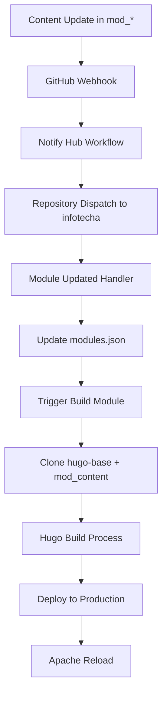

# Архитектурные решения InfoTech.io

## Обзор проекта

Данный документ описывает фактическую архитектуру образовательной платформы InfoTech.io, реализованную по принципу "Ось и спицы" с использованием статической генерации сайтов.

**Статус:** ✅ Полностью реализовано и развернуто в production  
**Домен:** infotecha.ru  
**Организация:** info-tech-io (GitHub)

## Общая архитектура платформы

### Концептуальная схема
```
┌─────────────────────────────────────────────────────────┐
│                 INFOTECHA.RU PLATFORM                   │
│  ┌─────────────────┐  ┌─────────────────┐               │
│  │   Central Hub   │  │  Module System  │               │
│  │  (infotecha)    │  │   (mod_*)       │               │
│  │                 │  │                 │               │
│  │ • modules.json  │  │ • Hugo content  │               │
│  │ • Main page     │  │ • Quiz Engine   │               │
│  │ • Navigation    │  │ • Static assets │               │
│  └─────────────────┘  └─────────────────┘               │
└─────────────────────────────────────────────────────────┘
            │                       │
            ▼                       ▼
  ┌─────────────────┐    ┌─────────────────┐
  │  Apache2 Web    │    │   GitHub CI/CD  │
  │    Server       │    │   Automation    │
  │                 │    │                 │
  │ • SSL/HTTPS     │    │ • Auto-deploy   │
  │ • Subdomain     │    │ • Module build  │
  │   routing       │    │ • Content sync  │
  │ • Security      │    │                 │
  └─────────────────┘    └─────────────────┘
```

## Основные архитектурные принципы

### 1. Модульная структура
- **Центральный репозиторий** (`infotecha`) - управление платформой и реестром модулей
- **Модульные репозитории** (`mod_*`) - содержат образовательный контент
- **Базовый шаблон** (`hugo-base`) - единая тема и компоненты для всех модулей
- **Quiz Engine** - переиспользуемый компонент интерактивного тестирования

### 2. Статическая генерация сайтов
- **Hugo Static Site Generator** - преобразование Markdown в HTML
- **Отсутствие серверных компонентов** - только статические файлы
- **CDN-готовая архитектура** - быстрая доставка контента

### 3. Автоматизированная CI/CD цепочка
```
Content Update → GitHub Webhook → Module Registry → Hugo Build → Production Deploy
```

## Доменная структура

```
infotecha.ru                    # Главный хаб (ОСЬ)
├── linux-base.infotecha.ru      # Основы Linux
├── linux-advanced.infotecha.ru  # Продвинутый Linux  
├── linux-professional.infotecha.ru # Linux для профессионалов
└── ...
```

## Репозиторная архитектура

### GitHub Организация: info-tech-io

```
info-tech-io/
├── infotecha              # Центральный хаб
├── hugo-base             # Базовый шаблон модулей
├── quiz                  # Quiz Engine
├── mod_linux_base        # Контент: Основы Linux
├── mod_linux_advanced    # Контент: Продвинутый Linux
├── mod_linux_professional # Контент: Linux для профессионалов
├── mod_template          # Шаблон для новых модулей
├── info-tech-cli         # CLI инструменты автоматизации
```

### Ключевые репозитории

#### 1. `infotecha` - Центральный хаб
**Назначение:** Управление платформой, реестр модулей, главная страница  
**Технологии:** HTML, CSS, JavaScript, GitHub Actions  
**Структура:**
```
infotecha/
├── index.html                    # Главная страница
├── modules.json                  # Реестр модулей
├── assets/                       # Статические ресурсы
├── .github/workflows/
│   ├── module-updated.yml        # Обработка изменений модулей
│   └── build-module.yml          # Сборка и деплой модулей
└── scripts/                      # Утилиты платформы
```

#### 2. `hugo-base` - Базовый шаблон
**Назначение:** Единая тема, компоненты, стили для всех модулей  
**Технологии:** Hugo, Compose Theme, Quiz Engine Integration  
**Структура:**
```
hugo-base/
├── hugo.toml                     # Конфигурация Hugo
├── content/                      # Структура контента
├── layouts/                      # Шаблоны страниц
├── static/                       # Статические ресурсы
│   └── quiz/                     # Quiz Engine файлы
├── themes/compose/               # Git submodule - Hugo theme
└── .github/workflows/            # CI/CD для шаблона
```

#### 3. `mod_*` - Образовательные модули
**Назначение:** Контент курсов, уроки, тесты  
**Технологии:** Markdown, Quiz Engine JSON  
**Структура (пример `mod_linux_base`):**
```
mod_linux_base/
├── content/
│   ├── _index.md                 # Главная страница модуля
│   ├── intro/                    # Введение
│   ├── topic-01/                 # Темы курса
│   ├── topic-02/
│   └── tests/
│       └── quiz-01.json          # Quiz Engine тесты
└── .github/workflows/
    └── notify-hub.yml            # Уведомление центрального хаба
```

## Технические решения

### Основные технологии
- **Hugo Static Site Generator** - генерация статических сайтов
- **Apache2 + mod_rewrite** - веб-сервер с роутингом поддоменов
- **GitHub Actions** - CI/CD автоматизация
- **Let's Encrypt** - SSL сертификаты (включая wildcard)
- **Quiz Engine** - интерактивная система тестирования

### Инфраструктурные компоненты

#### 1. Apache2 Web Server
**Конфигурация:**
```apache
<VirtualHost *:443>
    ServerName infotecha.ru
    ServerAlias *.infotecha.ru
    DocumentRoot /var/www/infotecha.ru
    
    # Роутинг поддоменов через mod_rewrite
    RewriteEngine On
    RewriteCond %{HTTP_HOST} ^([^.]+)\.infotecha\.ru$
    RewriteRule ^(.*)$ /%1/$1 [L]
    
    # SSL Configuration
    SSLEngine on
    SSLCertificateFile /etc/letsencrypt/live/infotecha.ru/fullchain.pem
    SSLCertificateKeyFile /etc/letsencrypt/live/infotecha.ru/privkey.pem
</VirtualHost>
```

**Структура файловой системы:**
```
/var/www/infotecha.ru/
├── index.html              # Главная страница
├── modules.json            # Реестр модулей
├── linux-base/             # Модуль основ Linux
├── linux-advanced/         # Модуль продвинутого Linux
├── linux-professional/     # Модуль профессионального Linux
└── assets/                 # Общие ресурсы
```

#### 2. SSL/TLS Security
- **Let's Encrypt certificates** для всех доменов и поддоменов
- **Автоматическое обновление** через certbot
- **Security Headers**: HSTS, X-Frame-Options, X-Content-Type-Options
- **HTTP → HTTPS redirects** для всех запросов

#### 3. DNS Infrastructure
```
infotecha.ru              → A → 94.232.43.166
www.infotecha.ru          → A → 94.232.43.166
*.infotecha.ru            → A → 94.232.43.166 (wildcard)
linux-base.infotecha.ru  → CNAME → infotecha.ru
```

## Процессы и интеграции

### CI/CD Pipeline

#### 1. Workflow изменения контента модуля


#### 2. Автоматическая сборка модуля
```yaml
# Ключевые этапы build-module.yml
- Checkout hugo-base template
- Checkout module content  
- Merge content with template
- Update Hugo configuration
- Initialize Git submodules
- Run Hugo build
- Deploy to /var/www/infotecha.ru/
- Reload Apache2
```

## Автоматизация

### Рабочий процесс
1. Изменение контента модуля (git push)
2. GitHub webhook активирует workflow
3. Объединение hugo-base + mod_content
4. Hugo build процесс
5. Деплой на сервер (/var/www/infotecha.ru/)
6. Apache reload для применения изменений

**Время деплоя:** От commit до production за 2-3 минуты

## Преимущества реализованной архитектуры

### ✅ Производительность
- Статические файлы загружаются мгновенно (< 500ms)
- Минимальное потребление ресурсов сервера
- Готовность к CDN интеграции

### ✅ Простота управления  
- Один VPS для всей платформы
- Автоматический деплой без вмешательства
- Минимальные операционные затраты

### ✅ Масштабируемость
- Новый модуль добавляется за 15 минут
- Независимые обновления модулей
- Горизонтальное масштабирование готово

### ✅ Надежность
- Отсутствие серверной логики = минимум сбоев
- Автоматическое восстановление SSL
- Простое резервное копирование

### ✅ Открытость
- 100% Open Source код и контент
- GitHub организация с полной прозрачностью
- Возможность контрибьюций от сообщества

## Текущий статус Production

### ✅ Полностью функциональные компоненты
1. **Центральная платформа (infotecha)**
   - Главная страница с каталогом модулей
   - modules.json реестр
   - Автоматизированные workflows

2. **Hugo-base template**
   - Базовый шаблон для всех модулей
   - Compose theme integration
   - Quiz Engine интеграция

3. **Quiz Engine v1.0.0**
   - Полнофункциональная система тестирования
   - JSON конфигурация тестов
   - Интеграция с Hugo шаблонами

4. **Продуктовая инфраструктура**
   - Debian сервер с Apache2
   - SSL сертификаты Let's Encrypt для всех доменов
   - DNS wildcard поддомены
   - Полная автоматизация CI/CD

5. **Модули курсов**
   - `mod_linux_base` - основной контент в production
   - `mod_linux_advanced` - готов к деплою
   - `mod_linux_professional` - готов к деплою

### Production URLs (все с SSL Grade A+)
- **Главная платформа:** https://infotecha.ru
- **Образовательные модули:**
  - https://linux-base.infotecha.ru
  - https://linux-advanced.infotecha.ru  
  - https://linux-professional.infotecha.ru

## Масштабируемость и развитие

### Готовность к росту
- **Новые модули:** Автоматическое создание через `mod_template` за 15 минут
- **CDN интеграция:** Архитектура готова к подключению глобальной CDN
- **Load balancing:** Возможность распределения нагрузки
- **Мониторинг:** Готовность к enterprise-level мониторингу

### Техническое развитие
- Миграция на более мощную инфраструктуру
- API для программной интеграции
- Аналитика пользовательского опыта
- Мультиязычная поддержка

---

**Заключение:** Архитектура продукта ИНФОТЕКА (infotecha.ru) представляет собой современное, масштабируемое решение для онлайн-образования с полной автоматизацией процессов разработки и развертывания. Платформа успешно работает в production и готова к дальнейшему развитию и масштабированию.