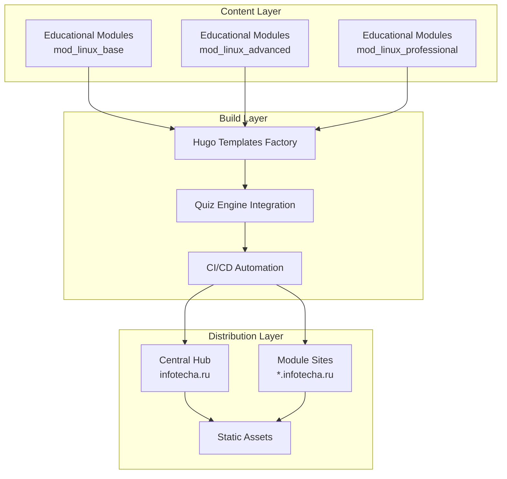
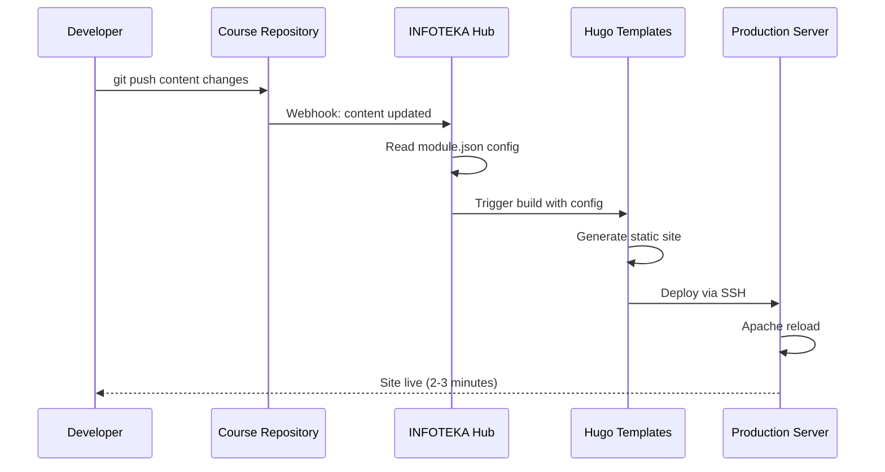

# Building INFOTEKA: Our Journey to a Scalable Educational Platform

When we started InfoTech.io, we had a simple but ambitious goal: make high-quality IT education accessible to everyone. What we didn't anticipate was the technical complexity of building an educational platform that could scale, remain fast, and be maintainable by a small team.

Today, [INFOTEKA](https://infotecha.ru) serves thousands of learners with three comprehensive Linux courses, delivers content in under 500ms, and can deploy updates from commit to production in 2-3 minutes. Here's how we built it.

## The Challenge: Balancing Simplicity and Scalability

### Initial Requirements
When we began planning INFOTEKA, we established several non-negotiable requirements:

1. **Performance**: Pages must load in under 500ms globally
2. **Scalability**: Support for dozens of courses without complexity explosion
3. **Maintainability**: Manageable by a small team with minimal operations overhead
4. **Cost-Effectiveness**: Low infrastructure costs while maintaining quality
5. **Developer Experience**: Easy for educators to create and update content
6. **Open Source**: Everything must be transparent and community-contributable

### The Traditional Approach Problem
Most educational platforms use heavy frameworks like Django, Rails, or modern SPA frameworks with complex backends. While powerful, these approaches presented several challenges for our use case:

- **Performance Overhead**: Database queries, server-side rendering, and API calls create latency
- **Infrastructure Complexity**: Requires databases, caching layers, CDNs, and multiple server instances
- **Operational Burden**: Monitoring, scaling, security updates, and maintenance overhead
- **Cost Scaling**: Server costs increase with user base and feature complexity

We needed a different approach.

## Our Solution: The Hub and Spoke Architecture

### Architectural Overview
We designed INFOTEKA using a "Hub and Spoke" pattern with static site generation:



### Core Architectural Principles

#### 1. Static-First Approach
Every page is generated as static HTML, CSS, and JavaScript:

```bash
# Build process example
hugo-templates/scripts/build.sh \
  --template educational \
  --content ./mod_linux_base/content \
  --theme compose \
  --components quiz-engine \
  --output ./dist
```

**Benefits:**
- **Lightning Fast**: No server processing, just file serving
- **Globally Distributable**: Works perfectly with CDNs
- **Secure**: No dynamic vulnerabilities or injection attacks
- **Scalable**: Handles traffic spikes without performance degradation

#### 2. Modular Repository Structure
Each course is an independent repository:

```
info-tech-io/
├── infotecha/                    # Central hub
├── hugo-templates/               # Build system
├── quiz/                        # Interactive components
├── mod_linux_base/              # Course: Linux Basics
├── mod_linux_advanced/          # Course: Advanced Linux
├── mod_linux_professional/      # Course: Professional Linux
└── mod_template/                # Template for new courses
```

**Benefits:**
- **Independent Development**: Teams can work on courses simultaneously
- **Granular Deployment**: Update one course without affecting others
- **Clear Ownership**: Each course has its own maintainers and contributors
- **Easy Scaling**: Adding new courses is just creating new repositories

#### 3. Configuration-Driven Build System
Each module defines its build requirements in `module.json`:

```json
{
  "name": "linux-base",
  "version": "1.2.0",
  "type": "educational",
  "build": {
    "template": "educational",
    "theme": "compose",
    "components": ["quiz-engine", "progress-tracker"]
  },
  "site": {
    "title": "Linux Basics Course",
    "description": "Complete beginner guide to Linux",
    "baseURL": "https://linux-base.infotecha.ru"
  },
  "content": {
    "source": "./content",
    "destination": "linux-base"
  }
}
```

This approach eliminated hardcoded build configurations and made the system self-documenting.

## Technical Implementation Deep Dive

### Hugo Templates Factory: Our Build Engine

The heart of our system is the Hugo Templates Factory, a flexible framework for generating static sites with Hugo:

#### Template System Architecture
```
hugo-templates/
├── templates/
│   ├── educational/             # Course template
│   ├── corporate/               # Business site template
│   └── documentation/           # Docs template
├── themes/
│   ├── compose/                 # Modern, responsive theme
│   ├── minimal/                 # Lightweight theme
│   └── custom/                  # Project-specific themes
├── components/
│   ├── quiz-engine/             # Interactive quizzes
│   ├── progress-tracker/        # Learning progress
│   └── search/                  # Content search
└── scripts/
    ├── build.sh                 # Main build script
    ├── validate.js              # Configuration validation
    └── deploy.sh                # Deployment automation
```

#### Build Process Flow
1. **Configuration Validation**: Ensure `module.json` meets schema requirements
2. **Template Assembly**: Combine template + theme + components
3. **Content Processing**: Transform Markdown to HTML with Hugo
4. **Asset Optimization**: Minify CSS/JS, optimize images
5. **Output Generation**: Create production-ready static site

### Quiz Engine: Bringing Interactivity to Static Sites

One challenge with static sites is interactivity. We solved this by creating a lightweight, embeddable Quiz Engine:

#### Architecture
```javascript
class QuizEngine {
  constructor(config) {
    this.questions = config.questions;
    this.currentQuestion = 0;
    this.score = 0;
    this.answers = [];
  }

  async loadQuiz(quizId) {
    // Load quiz configuration from JSON
    const response = await fetch(`/quizzes/${quizId}.json`);
    const config = await response.json();
    return new Quiz(config);
  }

  renderQuestion(questionIndex) {
    const question = this.questions[questionIndex];
    // Render question with appropriate UI
  }

  submitAnswer(answer) {
    // Process answer and update score
    this.answers[this.currentQuestion] = answer;
    this.calculateScore();
    this.nextQuestion();
  }
}
```

#### Integration with Hugo
```html
<!-- Quiz embedded in course content -->
<div id="quiz-container" data-quiz-id="linux-basics-01"></div>
<script>
  document.addEventListener('DOMContentLoaded', function() {
    const quiz = new QuizEngine({
      container: '#quiz-container',
      quizId: 'linux-basics-01',
      onComplete: function(results) {
        console.log('Quiz completed:', results);
      }
    });
    quiz.initialize();
  });
</script>
```

### Automated CI/CD Pipeline

Our deployment pipeline achieves the ambitious goal of 2-3 minute commit-to-production times:

#### Workflow Architecture


#### GitHub Actions Implementation
```yaml
# .github/workflows/module-updated.yml
name: Module Content Updated

on:
  repository_dispatch:
    types: [module-updated]

jobs:
  build-and-deploy:
    runs-on: ubuntu-latest
    steps:
      - name: Checkout hugo-templates
        uses: actions/checkout@v4
        with:
          repository: info-tech-io/hugo-templates
          token: ${{ secrets.PAT_TOKEN }}

      - name: Get module configuration
        run: |
          MODULE_REPO="${{ github.event.client_payload.repository }}"
          curl -H "Authorization: token ${{ secrets.PAT_TOKEN }}" \
               "https://api.github.com/repos/${MODULE_REPO}/contents/module.json" \
               | jq -r .content | base64 -d > module.json

      - name: Build site
        run: |
          npm install
          chmod +x scripts/build.sh
          scripts/build.sh --config module.json

      - name: Deploy to production
        run: |
          scripts/deploy.sh --target production --config module.json
```

### Infrastructure: Apache2 with Smart Routing

Our production infrastructure uses a single VPS with Apache2 and smart subdomain routing:

#### Apache Configuration
```apache
<VirtualHost *:443>
    ServerName infotecha.ru
    ServerAlias *.infotecha.ru
    DocumentRoot /var/www/infotecha.ru

    # Dynamic subdomain routing
    RewriteEngine On
    RewriteCond %{HTTP_HOST} ^([^.]+)\.infotecha\.ru$
    RewriteRule ^(.*)$ /%1/$1 [L]

    # Security headers
    Header always set Strict-Transport-Security "max-age=31536000; includeSubDomains"
    Header always set X-Frame-Options "SAMEORIGIN"
    Header always set X-Content-Type-Options "nosniff"

    # SSL configuration
    SSLEngine on
    SSLCertificateFile /etc/letsencrypt/live/infotecha.ru/fullchain.pem
    SSLCertificateKeyFile /etc/letsencrypt/live/infotecha.ru/privkey.pem
</VirtualHost>
```

#### File System Structure
```
/var/www/infotecha.ru/
├── index.html                   # Main hub page
├── linux-base/                  # Course: Linux Basics
│   ├── index.html
│   ├── intro/
│   ├── lessons/
│   └── quizzes/
├── linux-advanced/              # Course: Advanced Linux
└── linux-professional/         # Course: Professional Linux
```

This approach allows us to serve multiple courses from a single server while maintaining the illusion of separate sites.

## Performance Results

### Speed Metrics
Our architecture delivers exceptional performance:

- **Time to First Byte**: <200ms average
- **Largest Contentful Paint**: <1.2s average
- **First Input Delay**: <50ms average
- **Cumulative Layout Shift**: <0.1 average

### Lighthouse Scores
All our courses consistently achieve:
- **Performance**: 98-100
- **Accessibility**: 95-100
- **Best Practices**: 100
- **SEO**: 95-100

### Load Testing Results
```bash
# Apache Bench results for concurrent users
ab -n 1000 -c 100 https://linux-base.infotecha.ru/

Requests per second:    847.23 [#/sec]
Time per request:       118.036 [ms] (mean)
Time per request:       1.180 [ms] (mean, across all concurrent requests)
Transfer rate:          2051.34 [Kbytes/sec] received
```

Our static approach handles traffic spikes gracefully without performance degradation.

## Scalability and Maintenance

### Adding New Courses
Creating a new course is streamlined:

```bash
# 1. Create new repository from template
gh repo create info-tech-io/mod_python_basics --template info-tech-io/mod_template

# 2. Configure module.json
cat > module.json << EOF
{
  "name": "python-basics",
  "type": "educational",
  "build": {
    "template": "educational",
    "theme": "compose",
    "components": ["quiz-engine"]
  }
}
EOF

# 3. Add content and push
git add .
git commit -m "feat: initialize Python basics course"
git push origin main

# Deployment happens automatically in 2-3 minutes
```

### Operational Overhead
Our architecture requires minimal operational maintenance:

- **Server Management**: Basic VPS with automated updates
- **SSL Certificates**: Automatic renewal via certbot
- **Backups**: Daily automated backups of content and configuration
- **Monitoring**: Simple uptime monitoring and log analysis

### Cost Efficiency
Total infrastructure costs:
- **VPS**: $10/month (sufficient for current scale)
- **Domain**: $15/year
- **SSL**: Free (Let's Encrypt)
- **Total**: ~$135/year for the entire platform

## Lessons Learned

### What Worked Well

#### 1. Static-First Philosophy
Choosing static generation was our best architectural decision:
- Eliminated 90% of potential security vulnerabilities
- Achieved exceptional performance without optimization effort
- Simplified deployment and scaling dramatically
- Reduced operational complexity significantly

#### 2. Modular Repository Structure
Independent repositories for each course provided:
- Clear ownership and responsibility boundaries
- Parallel development without conflicts
- Easy experimentation with new course formats
- Simplified contributor onboarding

#### 3. Configuration-Driven Design
Using `module.json` for build configuration:
- Made the system self-documenting
- Enabled easy customization per course
- Simplified testing and validation
- Reduced hardcoded dependencies

### Challenges and Solutions

#### Challenge 1: Interactive Features on Static Sites
**Problem**: Static sites traditionally can't provide interactive learning experiences.

**Solution**: We developed Quiz Engine as a client-side JavaScript library that loads configuration from JSON files. This provides rich interactivity while maintaining static deployment.

#### Challenge 2: Content Management for Non-Technical Contributors
**Problem**: Git workflows can be intimidating for educators without technical backgrounds.

**Solution**: We created detailed documentation and are developing a web-based content editor that creates Git commits behind the scenes.

#### Challenge 3: Search Functionality
**Problem**: Static sites don't have server-side search capabilities.

**Solution**: We implemented client-side search using pre-built indexes generated during the build process. This provides fast, accurate search without server infrastructure.

### What We'd Do Differently

#### Earlier Investment in Tooling
We should have built the Hugo Templates Factory earlier. Initially, we used a monolithic `hugo-base` template, which became a bottleneck as we added more course types.

#### More Comprehensive Testing
While our build process includes basic validation, we should have implemented more comprehensive content testing, including:
- Link checking across all courses
- Accessibility auditing
- Performance regression testing

#### Better Analytics from Day One
We initially focused on technology over analytics. Earlier implementation of learning analytics would have provided better insights into student behavior and content effectiveness.

## Future Enhancements

### Short Term (3-6 months)
1. **Web Terminal Integration**: Browser-based terminal for hands-on practice
2. **Advanced Analytics**: Learning behavior tracking and insights
3. **Mobile Application**: Progressive Web App for offline learning
4. **Content Editor**: Web-based interface for non-technical contributors

### Long Term (6-12 months)
1. **AI-Powered Tutoring**: Personalized learning recommendations
2. **Real-time Collaboration**: Shared coding environments
3. **Video Integration**: Seamless video content embedding
4. **Certification System**: Blockchain-verified course completion certificates

## Technical Deep Dive: Code Examples

### Hugo Templates Factory Build Script
```bash
#!/bin/bash
# scripts/build.sh - Main build script

set -euo pipefail

CONFIG_FILE=""
OUTPUT_DIR="./dist"
DEPLOY_TARGET=""

while [[ $# -gt 0 ]]; do
  case $1 in
    --config)
      CONFIG_FILE="$2"
      shift 2
      ;;
    --output)
      OUTPUT_DIR="$2"
      shift 2
      ;;
    --deploy)
      DEPLOY_TARGET="$2"
      shift 2
      ;;
    *)
      echo "Unknown option $1"
      exit 1
      ;;
  esac
done

if [[ -z "$CONFIG_FILE" ]]; then
  echo "Error: --config is required"
  exit 1
fi

# Validate configuration
echo "Validating configuration..."
node scripts/validate.js "$CONFIG_FILE"

# Read configuration
MODULE_NAME=$(jq -r '.name' "$CONFIG_FILE")
TEMPLATE=$(jq -r '.build.template' "$CONFIG_FILE")
THEME=$(jq -r '.build.theme' "$CONFIG_FILE")
COMPONENTS=$(jq -r '.build.components[]' "$CONFIG_FILE")

echo "Building $MODULE_NAME with template $TEMPLATE..."

# Setup build environment
BUILD_DIR="./tmp/$MODULE_NAME"
rm -rf "$BUILD_DIR"
mkdir -p "$BUILD_DIR"

# Copy template
cp -r "templates/$TEMPLATE/"* "$BUILD_DIR/"

# Apply theme
if [[ "$THEME" != "null" ]]; then
  cp -r "themes/$THEME/"* "$BUILD_DIR/themes/$THEME/"
fi

# Add components
for component in $COMPONENTS; do
  echo "Adding component: $component"
  cp -r "components/$component/"* "$BUILD_DIR/"
done

# Build with Hugo
cd "$BUILD_DIR"
hugo --minify --destination "$OUTPUT_DIR"

echo "Build complete: $OUTPUT_DIR"

# Deploy if requested
if [[ -n "$DEPLOY_TARGET" ]]; then
  ../scripts/deploy.sh --target "$DEPLOY_TARGET" --source "$OUTPUT_DIR"
fi
```

### Quiz Engine Implementation
```javascript
// quiz-engine/src/QuizEngine.js
export class QuizEngine {
  constructor(options = {}) {
    this.container = document.querySelector(options.container);
    this.quizId = options.quizId;
    this.onComplete = options.onComplete || (() => {});
    this.onProgress = options.onProgress || (() => {});

    this.questions = [];
    this.currentIndex = 0;
    this.answers = [];
    this.score = 0;
    this.startTime = null;
  }

  async initialize() {
    try {
      const response = await fetch(`/quizzes/${this.quizId}.json`);
      if (!response.ok) {
        throw new Error(`Failed to load quiz: ${response.status}`);
      }

      const config = await response.json();
      this.questions = config.questions;
      this.startTime = Date.now();

      this.render();
    } catch (error) {
      console.error('Quiz initialization failed:', error);
      this.renderError('Failed to load quiz. Please try again.');
    }
  }

  render() {
    if (this.currentIndex >= this.questions.length) {
      this.renderResults();
      return;
    }

    const question = this.questions[this.currentIndex];
    const html = `
      <div class="quiz-question">
        <div class="quiz-progress">
          Question ${this.currentIndex + 1} of ${this.questions.length}
          <div class="progress-bar">
            <div class="progress-fill" style="width: ${(this.currentIndex / this.questions.length) * 100}%"></div>
          </div>
        </div>

        <h3>${question.question}</h3>

        <div class="quiz-options">
          ${question.options.map((option, index) => `
            <label class="quiz-option">
              <input type="radio" name="answer" value="${index}">
              <span>${option}</span>
            </label>
          `).join('')}
        </div>

        <div class="quiz-actions">
          <button class="quiz-submit" disabled>Submit Answer</button>
        </div>

        <div class="quiz-explanation" style="display: none;">
          <h4>Explanation:</h4>
          <p>${question.explanation}</p>
          <button class="quiz-next">Next Question</button>
        </div>
      </div>
    `;

    this.container.innerHTML = html;
    this.attachEventListeners();
  }

  attachEventListeners() {
    const radioButtons = this.container.querySelectorAll('input[type="radio"]');
    const submitButton = this.container.querySelector('.quiz-submit');
    const nextButton = this.container.querySelector('.quiz-next');

    radioButtons.forEach(radio => {
      radio.addEventListener('change', () => {
        submitButton.disabled = false;
      });
    });

    submitButton.addEventListener('click', () => {
      this.submitAnswer();
    });

    if (nextButton) {
      nextButton.addEventListener('click', () => {
        this.nextQuestion();
      });
    }
  }

  submitAnswer() {
    const selectedOption = this.container.querySelector('input[name="answer"]:checked');
    if (!selectedOption) return;

    const answerIndex = parseInt(selectedOption.value);
    const question = this.questions[this.currentIndex];
    const isCorrect = answerIndex === question.correct;

    this.answers[this.currentIndex] = {
      question: this.currentIndex,
      answer: answerIndex,
      correct: isCorrect,
      points: isCorrect ? (question.points || 1) : 0
    };

    if (isCorrect) {
      this.score += question.points || 1;
    }

    // Show explanation
    const explanation = this.container.querySelector('.quiz-explanation');
    explanation.style.display = 'block';

    // Disable submit button
    this.container.querySelector('.quiz-submit').disabled = true;

    // Style correct/incorrect
    const options = this.container.querySelectorAll('.quiz-option');
    options.forEach((option, index) => {
      if (index === question.correct) {
        option.classList.add('correct');
      } else if (index === answerIndex && !isCorrect) {
        option.classList.add('incorrect');
      }
    });

    this.onProgress({
      currentQuestion: this.currentIndex + 1,
      totalQuestions: this.questions.length,
      score: this.score,
      answers: this.answers
    });
  }

  nextQuestion() {
    this.currentIndex++;
    this.render();
  }

  renderResults() {
    const totalPoints = this.questions.reduce((sum, q) => sum + (q.points || 1), 0);
    const percentage = Math.round((this.score / totalPoints) * 100);
    const timeSpent = Math.round((Date.now() - this.startTime) / 1000);

    const html = `
      <div class="quiz-results">
        <h3>Quiz Complete!</h3>

        <div class="score-summary">
          <div class="score-circle">
            <span class="score-percentage">${percentage}%</span>
          </div>

          <div class="score-details">
            <p>Score: ${this.score} / ${totalPoints}</p>
            <p>Time: ${Math.floor(timeSpent / 60)}:${(timeSpent % 60).toString().padStart(2, '0')}</p>
            <p>Correct: ${this.answers.filter(a => a.correct).length} / ${this.questions.length}</p>
          </div>
        </div>

        <div class="quiz-actions">
          <button class="quiz-retry">Retry Quiz</button>
          <button class="quiz-review">Review Answers</button>
        </div>
      </div>
    `;

    this.container.innerHTML = html;

    this.container.querySelector('.quiz-retry').addEventListener('click', () => {
      this.restart();
    });

    this.container.querySelector('.quiz-review').addEventListener('click', () => {
      this.showReview();
    });

    this.onComplete({
      score: this.score,
      totalPoints: totalPoints,
      percentage: percentage,
      timeSpent: timeSpent,
      answers: this.answers
    });
  }

  restart() {
    this.currentIndex = 0;
    this.answers = [];
    this.score = 0;
    this.startTime = Date.now();
    this.render();
  }

  showReview() {
    // Implementation for reviewing answers
    console.log('Review functionality to be implemented');
  }

  renderError(message) {
    this.container.innerHTML = `
      <div class="quiz-error">
        <h3>Error</h3>
        <p>${message}</p>
        <button onclick="location.reload()">Retry</button>
      </div>
    `;
  }
}

// Auto-initialize quizzes on page load
document.addEventListener('DOMContentLoaded', () => {
  const quizContainers = document.querySelectorAll('[data-quiz-id]');

  quizContainers.forEach(container => {
    const quizId = container.dataset.quizId;
    const quiz = new QuizEngine({
      container: container,
      quizId: quizId,
      onComplete: (results) => {
        console.log('Quiz completed:', results);
        // Send analytics data
        if (typeof gtag !== 'undefined') {
          gtag('event', 'quiz_completed', {
            quiz_id: quizId,
            score: results.percentage,
            time_spent: results.timeSpent
          });
        }
      }
    });

    quiz.initialize();
  });
});
```

## Conclusion

Building INFOTEKA taught us that the best technology choices aren't always the most complex ones. By choosing static site generation, modular architecture, and automation-first development, we created a platform that:

- **Performs exceptionally** with sub-500ms loading times
- **Scales effortlessly** from our current 3 courses to hundreds
- **Costs almost nothing** to operate and maintain
- **Enables rapid development** with 2-3 minute deployments
- **Remains completely open source** and community-contributable

The key insight was realizing that educational content doesn't need dynamic server-side processing – it needs to be fast, accessible, and engaging. Static sites with smart client-side interactivity deliver all these benefits with a fraction of the complexity.

As we continue to grow INFOTEKA and expand our course offerings, this architecture gives us the foundation to scale sustainably while maintaining our commitment to open source principles and community-driven development.

---

**Interested in contributing to INFOTEKA?** Check out our [Developer Onboarding Guide](/open-source/onboarding/) to get started!

**Want to see the code?** All our repositories are open source: [github.com/info-tech-io](https://github.com/info-tech-io)