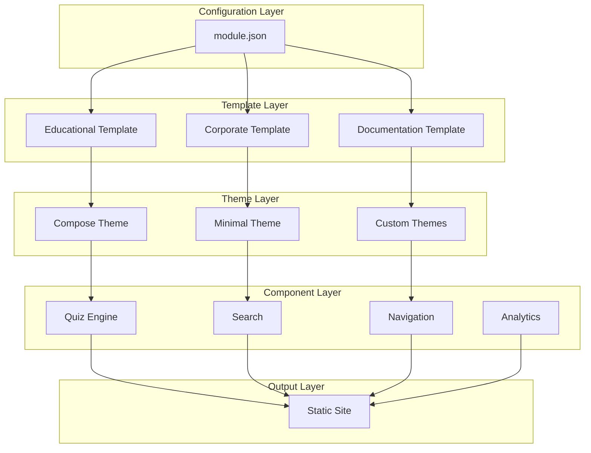

# Hugo Templates Factory: A Flexible Static Site Generation Framework

When we started building InfoTech.io's educational platform, we quickly realized that different types of content needed different presentations. A corporate website has different requirements than educational courses, which differ from technical documentation. Yet we wanted consistency, maintainability, and the ability to rapidly deploy new sites.

Our solution was the Hugo Templates Factory – a flexible, modular framework that generates Hugo-based static sites with configurable templates, themes, and components. Today, it powers not just our educational platform but also our corporate site, product documentation, and this blog.

## The Problem: Balancing Flexibility and Consistency

### The Monolithic Template Dilemma

Initially, we used a single, monolithic Hugo template called `hugo-base`. While this worked for our first few courses, it quickly became a bottleneck:

```
hugo-base/
├── layouts/              # One-size-fits-all layouts
├── static/              # Shared assets for all sites
├── config.yaml          # Global configuration
└── content/             # Mixed content types
```

**Problems we encountered:**
- **Inflexibility**: Educational sites needed features that corporate sites didn't
- **Complexity**: Single template tried to handle all use cases
- **Maintenance Overhead**: Changes required careful testing across all site types
- **Developer Experience**: Contributors had to understand the entire system
- **Coupling**: Sites were tightly coupled to a specific template version

### Requirements for a Better Solution

We needed a system that could:

1. **Generate different site types** (educational, corporate, documentation)
2. **Share common components** (navigation, footer, search)
3. **Allow theme customization** without duplicating code
4. **Enable rapid deployment** of new sites
5. **Maintain consistency** across all sites
6. **Scale with our growth** from 3 to 100+ sites

## Our Solution: Hugo Templates Factory

### Architectural Overview

The Hugo Templates Factory implements a **composition-over-inheritance** pattern with three key abstractions:



### Core Architecture Components

#### 1. Templates: Site Structure and Behavior
Templates define the overall structure and functionality of different site types:

```
templates/
├── educational/         # For courses and learning content
│   ├── layouts/
│   │   ├── _default/
│   │   ├── lesson/
│   │   └── quiz/
│   ├── archetypes/
│   └── config/
├── corporate/          # For business websites
│   ├── layouts/
│   │   ├── _default/
│   │   ├── about/
│   │   └── products/
│   └── config/
└── documentation/      # For technical docs
    ├── layouts/
    │   ├── _default/
    │   ├── api/
    │   └── guide/
    └── config/
```

#### 2. Themes: Visual Design and Styling
Themes provide visual design that can be applied to any template:

```
themes/
├── compose/            # Modern, feature-rich theme
│   ├── static/css/
│   ├── static/js/
│   ├── layouts/partials/
│   └── config/
├── minimal/            # Lightweight, fast theme
│   ├── static/css/
│   └── layouts/partials/
└── custom/             # Project-specific themes
    ├── infotecha/
    └── corporate/
```

#### 3. Components: Reusable Functionality
Components add specific functionality that can be mixed into any template:

```
components/
├── quiz-engine/        # Interactive quizzes
│   ├── layouts/shortcodes/
│   ├── static/js/
│   └── static/css/
├── search/             # Content search
│   ├── layouts/partials/
│   └── static/js/
├── analytics/          # Usage tracking
│   ├── layouts/partials/
│   └── config/
└── progress-tracker/   # Learning progress
    ├── static/js/
    └── layouts/partials/
```

## Implementation Deep Dive

### Configuration-Driven Architecture

Everything starts with a `module.json` file that describes what to build:

```json
{
  "name": "linux-advanced",
  "version": "1.2.0",
  "type": "educational",
  "build": {
    "template": "educational",
    "theme": "compose",
    "components": [
      "quiz-engine",
      "progress-tracker",
      "search",
      "analytics"
    ]
  },
  "site": {
    "title": "Advanced Linux Administration",
    "description": "Master Linux system administration",
    "baseURL": "https://linux-advanced.infotecha.ru",
    "language": "en",
    "author": "InfoTech.io"
  },
  "content": {
    "source": "./content",
    "destination": "linux-advanced"
  },
  "features": {
    "enableSearch": true,
    "enableProgress": true,
    "enableComments": false,
    "enableAnalytics": true
  },
  "quiz": {
    "showHints": true,
    "allowRetakes": true,
    "trackProgress": true
  }
}
```

### Build Process Implementation

The magic happens in our build script, which assembles sites from these modular pieces:

```bash
#!/bin/bash
# scripts/build.sh - Hugo Templates Factory build script

set -euo pipefail

# Parse command line arguments
CONFIG_FILE=""
OUTPUT_DIR="./dist"
SERVE_MODE=false
VERBOSE=false

while [[ $# -gt 0 ]]; do
  case $1 in
    --config)
      CONFIG_FILE="$2"
      shift 2
      ;;
    --output)
      OUTPUT_DIR="$2"
      shift 2
      ;;
    --serve)
      SERVE_MODE=true
      shift
      ;;
    --verbose)
      VERBOSE=true
      shift
      ;;
    *)
      echo "Unknown option $1"
      exit 1
      ;;
  esac
done

# Validation
if [[ -z "$CONFIG_FILE" ]]; then
  echo "Error: --config is required"
  echo "Usage: $0 --config module.json [--output dist] [--serve] [--verbose]"
  exit 1
fi

if [[ ! -f "$CONFIG_FILE" ]]; then
  echo "Error: Configuration file not found: $CONFIG_FILE"
  exit 1
fi

# Verbose logging helper
log() {
  if [[ "$VERBOSE" == "true" ]]; then
    echo "[$(date '+%Y-%m-%d %H:%M:%S')] $*"
  fi
}

# Validate configuration against JSON schema
log "Validating configuration..."
if ! node scripts/validate-config.js "$CONFIG_FILE"; then
  echo "Error: Configuration validation failed"
  exit 1
fi

# Extract configuration values
MODULE_NAME=$(jq -r '.name' "$CONFIG_FILE")
TEMPLATE=$(jq -r '.build.template' "$CONFIG_FILE")
THEME=$(jq -r '.build.theme' "$CONFIG_FILE")
COMPONENTS=$(jq -r '.build.components[]?' "$CONFIG_FILE")

log "Building module: $MODULE_NAME"
log "Template: $TEMPLATE"
log "Theme: $THEME"
log "Components: $COMPONENTS"

# Create build environment
BUILD_DIR="./tmp/build_${MODULE_NAME}_$(date +%s)"
rm -rf "$BUILD_DIR"
mkdir -p "$BUILD_DIR"

log "Created build directory: $BUILD_DIR"

# Step 1: Copy base template
if [[ ! -d "templates/$TEMPLATE" ]]; then
  echo "Error: Template not found: templates/$TEMPLATE"
  exit 1
fi

log "Copying template: $TEMPLATE"
cp -r "templates/$TEMPLATE/"* "$BUILD_DIR/"

# Step 2: Apply theme
if [[ "$THEME" != "null" && -d "themes/$THEME" ]]; then
  log "Applying theme: $THEME"

  # Create themes directory if it doesn't exist
  mkdir -p "$BUILD_DIR/themes/$THEME"

  # Copy theme files
  cp -r "themes/$THEME/"* "$BUILD_DIR/themes/$THEME/"

  # Update Hugo config to use theme
  echo "theme = '$THEME'" >> "$BUILD_DIR/config.toml"
fi

# Step 3: Add components
if [[ -n "$COMPONENTS" ]]; then
  for component in $COMPONENTS; do
    log "Adding component: $component"

    if [[ ! -d "components/$component" ]]; then
      echo "Warning: Component not found: components/$component"
      continue
    fi

    # Copy component layouts
    if [[ -d "components/$component/layouts" ]]; then
      cp -r "components/$component/layouts/"* "$BUILD_DIR/layouts/" 2>/dev/null || true
    fi

    # Copy component static assets
    if [[ -d "components/$component/static" ]]; then
      cp -r "components/$component/static/"* "$BUILD_DIR/static/" 2>/dev/null || true
    fi

    # Merge component config
    if [[ -f "components/$component/config.toml" ]]; then
      cat "components/$component/config.toml" >> "$BUILD_DIR/config.toml"
    fi
  done
fi

# Step 4: Apply site-specific configuration
log "Applying site configuration..."
node scripts/apply-config.js "$CONFIG_FILE" "$BUILD_DIR/config.toml"

# Step 5: Copy content
CONTENT_SOURCE=$(jq -r '.content.source' "$CONFIG_FILE")
if [[ -d "$CONTENT_SOURCE" ]]; then
  log "Copying content from: $CONTENT_SOURCE"
  cp -r "$CONTENT_SOURCE/"* "$BUILD_DIR/content/"
else
  echo "Warning: Content source not found: $CONTENT_SOURCE"
fi

# Step 6: Build with Hugo
cd "$BUILD_DIR"

if [[ "$SERVE_MODE" == "true" ]]; then
  log "Starting Hugo development server..."
  hugo server --bind 0.0.0.0 --buildDrafts --buildFuture --disableFastRender
else
  log "Building static site..."

  # Production build with optimization
  hugo \
    --minify \
    --cleanDestinationDir \
    --destination "../$OUTPUT_DIR" \
    --baseURL "$(jq -r '.site.baseURL' "../$CONFIG_FILE")"

  cd ..

  # Step 7: Post-build optimization
  log "Running post-build optimization..."

  # Optimize images (if imagemin is available)
  if command -v imagemin >/dev/null 2>&1; then
    find "$OUTPUT_DIR" -name "*.jpg" -o -name "*.png" -o -name "*.gif" | \
      xargs imagemin --out-dir="$OUTPUT_DIR"
  fi

  # Generate sitemap.xml if not present
  if [[ ! -f "$OUTPUT_DIR/sitemap.xml" ]]; then
    node scripts/generate-sitemap.js "$CONFIG_FILE" "$OUTPUT_DIR"
  fi

  # Generate robots.txt
  node scripts/generate-robots.js "$CONFIG_FILE" "$OUTPUT_DIR"

  log "Build complete: $OUTPUT_DIR"

  # Cleanup build directory
  rm -rf "$BUILD_DIR"
fi
```

### Component Integration System

Components are designed to be completely modular and reusable. Here's how the Quiz Engine component integrates:

#### Component Structure
```
components/quiz-engine/
├── layouts/
│   ├── shortcodes/
│   │   └── quiz.html           # Hugo shortcode for embedding quizzes
│   └── partials/
│       └── quiz-scripts.html   # JavaScript and CSS includes
├── static/
│   ├── js/
│   │   ├── quiz-engine.js      # Core quiz functionality
│   │   └── quiz-analytics.js   # Analytics integration
│   └── css/
│       └── quiz-styles.css     # Quiz-specific styles
├── config.toml                 # Component configuration
└── README.md                   # Component documentation
```

#### Hugo Shortcode Implementation
```html
<!-- layouts/shortcodes/quiz.html -->
{{ $quizId := .Get "id" }}
{{ $config := .Get "config" | default "default" }}

<div
  class="quiz-container"
  data-quiz-id="{{ $quizId }}"
  data-config="{{ $config }}"
  data-base-url="{{ .Site.BaseURL }}"
>
  <div class="quiz-loading">
    <div class="spinner"></div>
    <p>Loading quiz...</p>
  </div>
</div>

{{ if not (.Page.Scratch.Get "quiz-engine-loaded") }}
  {{ .Page.Scratch.Set "quiz-engine-loaded" true }}
  {{ partial "quiz-scripts.html" . }}
{{ end }}
```

#### Content Usage
In course content, educators can easily embed quizzes:

```markdown
---
title: "Linux File Permissions"
description: "Understanding file permissions in Linux"
---

# Linux File Permissions

File permissions in Linux control who can read, write, and execute files.

## Basic Permission Types

- **Read (r)**: View file contents
- **Write (w)**: Modify file contents
- **Execute (x)**: Run file as program


## Advanced Permissions

For more complex scenarios, Linux provides additional permission mechanisms...

```

### Theme System Architecture

Themes provide visual consistency while allowing customization:

#### Compose Theme Structure
```
themes/compose/
├── static/
│   ├── css/
│   │   ├── main.css            # Main stylesheet
│   │   ├── components.css      # Component styles
│   │   └── responsive.css      # Mobile responsiveness
│   ├── js/
│   │   ├── main.js            # Core JavaScript
│   │   └── components.js       # Interactive components
│   └── fonts/                  # Web fonts
├── layouts/
│   ├── _default/
│   │   ├── baseof.html        # Base template
│   │   ├── single.html        # Single page template
│   │   └── list.html          # List page template
│   └── partials/
│       ├── header.html        # Site header
│       ├── footer.html        # Site footer
│       ├── navigation.html    # Navigation menu
│       └── sidebar.html       # Sidebar content
├── config/
│   └── theme.toml             # Theme configuration
└── README.md
```

#### CSS Architecture
```css
/* themes/compose/static/css/main.css */

/* CSS Custom Properties for theming */
:root {
  /* Color palette */
  --color-primary: #007bff;
  --color-secondary: #6c757d;
  --color-success: #28a745;
  --color-warning: #ffc107;
  --color-error: #dc3545;

  /* Typography */
  --font-family-base: 'Inter', system-ui, sans-serif;
  --font-family-mono: 'JetBrains Mono', monospace;
  --font-size-base: 1rem;
  --line-height-base: 1.6;

  /* Spacing */
  --spacing-xs: 0.25rem;
  --spacing-sm: 0.5rem;
  --spacing-md: 1rem;
  --spacing-lg: 1.5rem;
  --spacing-xl: 3rem;

  /* Layout */
  --container-max-width: 1200px;
  --sidebar-width: 250px;
  --header-height: 70px;
}

/* Base styles */
body {
  font-family: var(--font-family-base);
  font-size: var(--font-size-base);
  line-height: var(--line-height-base);
  color: var(--color-text);
  background-color: var(--color-background);
}

/* Component styles */
.quiz-container {
  background: var(--color-background-card);
  border: 1px solid var(--color-border);
  border-radius: 8px;
  padding: var(--spacing-lg);
  margin: var(--spacing-lg) 0;
}

.quiz-question {
  margin-bottom: var(--spacing-md);
}

.quiz-option {
  display: block;
  padding: var(--spacing-sm);
  margin: var(--spacing-xs) 0;
  border: 1px solid var(--color-border);
  border-radius: 4px;
  cursor: pointer;
  transition: all 0.2s ease;
}

.quiz-option:hover {
  background-color: var(--color-background-hover);
}

.quiz-option.correct {
  background-color: var(--color-success);
  color: white;
  border-color: var(--color-success);
}

.quiz-option.incorrect {
  background-color: var(--color-error);
  color: white;
  border-color: var(--color-error);
}

/* Responsive design */
@media (max-width: 768px) {
  :root {
    --font-size-base: 0.9rem;
    --spacing-lg: 1rem;
    --spacing-xl: 2rem;
  }

  .quiz-container {
    padding: var(--spacing-md);
    margin: var(--spacing-md) 0;
  }
}

/* Dark mode support */
@media (prefers-color-scheme: dark) {
  :root {
    --color-text: #e9ecef;
    --color-background: #212529;
    --color-background-card: #343a40;
    --color-border: #495057;
    --color-background-hover: #495057;
  }
}
```

## Advanced Features

### JSON Schema Validation

To ensure configuration integrity, we validate all `module.json` files against JSON schemas:

```javascript
// scripts/validate-config.js
const Ajv = require('ajv');
const fs = require('fs');
const path = require('path');

const ajv = new Ajv({ allErrors: true });

// Load schema
const schemaPath = path.join(__dirname, '../schemas/module.schema.json');
const schema = JSON.parse(fs.readFileSync(schemaPath, 'utf8'));

// Validate configuration
function validateConfig(configPath) {
  try {
    const config = JSON.parse(fs.readFileSync(configPath, 'utf8'));
    const validate = ajv.compile(schema);
    const valid = validate(config);

    if (!valid) {
      console.error('Configuration validation failed:');
      validate.errors.forEach(error => {
        console.error(`  ${error.instancePath}: ${error.message}`);
      });
      return false;
    }

    console.log('Configuration validation passed');
    return true;
  } catch (error) {
    console.error('Error reading configuration:', error.message);
    return false;
  }
}

// CLI usage
if (require.main === module) {
  const configPath = process.argv[2];
  if (!configPath) {
    console.error('Usage: node validate-config.js <config-file>');
    process.exit(1);
  }

  const isValid = validateConfig(configPath);
  process.exit(isValid ? 0 : 1);
}

module.exports = { validateConfig };
```

#### Module Schema Definition
```json
{
  "$schema": "http://json-schema.org/draft-07/schema#",
  "title": "Hugo Templates Factory Module Configuration",
  "type": "object",
  "required": ["name", "version", "type", "build", "site"],
  "properties": {
    "name": {
      "type": "string",
      "pattern": "^[a-z0-9-]+$",
      "description": "Module name (lowercase, hyphens allowed)"
    },
    "version": {
      "type": "string",
      "pattern": "^\\d+\\.\\d+\\.\\d+$",
      "description": "Semantic version (e.g., 1.2.3)"
    },
    "type": {
      "type": "string",
      "enum": ["educational", "corporate", "documentation", "blog"],
      "description": "Module type"
    },
    "build": {
      "type": "object",
      "required": ["template"],
      "properties": {
        "template": {
          "type": "string",
          "enum": ["educational", "corporate", "documentation", "blog"]
        },
        "theme": {
          "type": "string",
          "enum": ["compose", "minimal", "custom"]
        },
        "components": {
          "type": "array",
          "items": {
            "type": "string",
            "enum": [
              "quiz-engine",
              "search",
              "analytics",
              "progress-tracker",
              "comments",
              "social-sharing"
            ]
          }
        }
      }
    },
    "site": {
      "type": "object",
      "required": ["title", "baseURL"],
      "properties": {
        "title": {
          "type": "string",
          "minLength": 1,
          "maxLength": 100
        },
        "description": {
          "type": "string",
          "maxLength": 200
        },
        "baseURL": {
          "type": "string",
          "format": "uri"
        },
        "language": {
          "type": "string",
          "pattern": "^[a-z]{2}(-[A-Z]{2})?$"
        },
        "author": {
          "type": "string",
          "maxLength": 100
        }
      }
    },
    "content": {
      "type": "object",
      "properties": {
        "source": {
          "type": "string",
          "default": "./content"
        },
        "destination": {
          "type": "string"
        }
      }
    },
    "features": {
      "type": "object",
      "properties": {
        "enableSearch": {
          "type": "boolean",
          "default": false
        },
        "enableProgress": {
          "type": "boolean",
          "default": false
        },
        "enableComments": {
          "type": "boolean",
          "default": false
        },
        "enableAnalytics": {
          "type": "boolean",
          "default": false
        }
      }
    }
  }
}
```

### Performance Optimization

The Hugo Templates Factory includes several performance optimizations:

#### Build-Time Optimizations
```bash
# Image optimization
find "$OUTPUT_DIR" -name "*.jpg" -o -name "*.png" | while read -r img; do
  # Compress JPEG images
  if [[ "$img" =~ \.jpg$ ]]; then
    jpegoptim --max=85 --strip-all "$img"
  fi

  # Compress PNG images
  if [[ "$img" =~ \.png$ ]]; then
    optipng -o7 "$img"
  fi
done

# CSS and JavaScript minification
find "$OUTPUT_DIR" -name "*.css" | while read -r css; do
  # Minify CSS
  npx cleancss -o "$css" "$css"
done

find "$OUTPUT_DIR" -name "*.js" | while read -r js; do
  # Minify JavaScript
  npx terser "$js" -o "$js" --compress --mangle
done

# Generate WebP versions of images
find "$OUTPUT_DIR" -name "*.jpg" -o -name "*.png" | while read -r img; do
  cwebp -q 85 "$img" -o "${img%.*}.webp"
done
```

#### Runtime Performance Features
```html
<!-- layouts/partials/performance.html -->
<!-- Preload critical resources -->
<link rel="preload" href="{{ "fonts/inter.woff2" | relURL }}" as="font" type="font/woff2" crossorigin>
<link rel="preload" href="{{ "css/critical.css" | relURL }}" as="style">

<!-- DNS prefetch for external resources -->
<link rel="dns-prefetch" href="//fonts.googleapis.com">
<link rel="dns-prefetch" href="//www.google-analytics.com">

<!-- Preconnect to CDN -->
<link rel="preconnect" href="https://cdn.infotecha.ru" crossorigin>

<!-- Critical CSS inlined -->
<style>
  {{ readFile "static/css/critical.css" | safeCSS }}
</style>

<!-- Lazy load non-critical CSS -->
<link rel="preload" href="{{ "css/main.css" | relURL }}" as="style" onload="this.onload=null;this.rel='stylesheet'">
<noscript><link rel="stylesheet" href="{{ "css/main.css" | relURL }}"></noscript>
```

### CLI Tool Integration

We also built a CLI tool for easier interaction with the Hugo Templates Factory:

```bash
# Install Hugo Templates CLI
npm install -g @info-tech-io/hugo-templates

# Create new site from template
hugo-templates create \
  --template educational \
  --theme compose \
  --name "my-course" \
  --title "My Awesome Course"

# Build existing site
hugo-templates build --config module.json --output ./dist

# Serve for development
hugo-templates serve --config module.json --port 3000

# Validate configuration
hugo-templates validate --config module.json

# List available templates and themes
hugo-templates list --templates
hugo-templates list --themes
hugo-templates list --components
```

## Real-World Usage Examples

### Educational Course Configuration
```json
{
  "name": "python-basics",
  "version": "1.0.0",
  "type": "educational",
  "build": {
    "template": "educational",
    "theme": "compose",
    "components": [
      "quiz-engine",
      "progress-tracker",
      "search",
      "analytics"
    ]
  },
  "site": {
    "title": "Python Programming Basics",
    "description": "Learn Python programming from the ground up",
    "baseURL": "https://python-basics.infotecha.ru",
    "language": "en",
    "author": "InfoTech.io"
  },
  "features": {
    "enableSearch": true,
    "enableProgress": true,
    "enableAnalytics": true
  },
  "quiz": {
    "showHints": true,
    "allowRetakes": true,
    "trackProgress": true
  }
}
```

### Corporate Website Configuration
```json
{
  "name": "info-tech-corporate",
  "version": "2.1.0",
  "type": "corporate",
  "build": {
    "template": "corporate",
    "theme": "compose",
    "components": [
      "search",
      "analytics",
      "social-sharing"
    ]
  },
  "site": {
    "title": "InfoTech.io",
    "description": "Open Source Educational Technology Organization",
    "baseURL": "https://info-tech.io",
    "language": "en",
    "author": "InfoTech.io Organization"
  },
  "features": {
    "enableSearch": true,
    "enableAnalytics": true,
    "enableComments": false
  },
  "corporate": {
    "showTeam": true,
    "showTestimonials": false,
    "enableContactForm": true
  }
}
```

### Documentation Site Configuration
```json
{
  "name": "quiz-engine-docs",
  "version": "1.0.0",
  "type": "documentation",
  "build": {
    "template": "documentation",
    "theme": "minimal",
    "components": [
      "search",
      "analytics"
    ]
  },
  "site": {
    "title": "Quiz Engine Documentation",
    "description": "Complete guide to the InfoTech.io Quiz Engine",
    "baseURL": "https://quiz.info-tech.io",
    "language": "en",
    "author": "InfoTech.io"
  },
  "features": {
    "enableSearch": true,
    "enableAnalytics": true
  },
  "documentation": {
    "showTOC": true,
    "enableEditLinks": true,
    "enableVersioning": false
  }
}
```

## Benefits and Results

### Development Speed
The Hugo Templates Factory dramatically improved our development velocity:

- **New site creation**: From 2-3 days to 15 minutes
- **Design updates**: Apply to all sites simultaneously
- **Component deployment**: Add features across all sites at once
- **Maintenance**: Single codebase for templates, themes, and components

### Consistency and Quality
- **Visual consistency**: All sites share design language
- **Code quality**: Centralized, reviewed, and tested components
- **Performance**: Optimized templates and themes
- **Accessibility**: Built-in accessibility features

### Scalability Metrics
Since implementing the Hugo Templates Factory:

- **Sites deployed**: 8 active sites (3 educational, 2 corporate, 3 documentation)
- **Build time**: Average 45 seconds per site
- **Performance**: All sites achieve Lighthouse scores >95
- **Maintenance time**: Reduced by 70%

### Developer Experience
```bash
# Before: Creating a new educational site
git clone hugo-base
# Edit countless files
# Test thoroughly
# Deploy manually
# Time: 2-3 days

# After: Creating a new educational site
hugo-templates create --template educational --name my-course
hugo-templates build --config module.json
hugo-templates deploy --target production
# Time: 15 minutes
```

## Lessons Learned

### What Worked Well

#### 1. Composition Over Inheritance
Breaking the monolithic template into composable pieces was our best decision. It enabled:
- Independent development of templates, themes, and components
- Easy mixing and matching of functionality
- Clear separation of concerns
- Simplified testing and maintenance

#### 2. Configuration-Driven Design
Using `module.json` to drive the build process provided:
- Self-documenting site configurations
- Easy validation and error checking
- Consistent API across all site types
- Simple automation and CI/CD integration

#### 3. Component Architecture
Building reusable components enabled:
- Feature sharing across different site types
- Consistent user experience
- Easier maintenance and updates
- Community contributions

### Challenges and Solutions

#### Challenge 1: Hugo Theme Limitations
**Problem**: Hugo's theme system assumes one theme per site, but we needed multiple theme layers.

**Solution**: We implemented our own theme composition system that merges multiple theme directories during the build process.

#### Challenge 2: Component Dependency Management
**Problem**: Components might depend on each other (e.g., analytics depends on certain DOM elements).

**Solution**: We created a dependency resolution system in our build script that ensures components are loaded in the correct order.

#### Challenge 3: Performance with Many Components
**Problem**: Adding many components could bloat the final site.

**Solution**: We implemented tree shaking – only code actually used by the site is included in the final build.

### What We'd Do Differently

#### Earlier API Design
We should have designed the component API more carefully from the start. We've had to make several breaking changes as we learned how components interact.

#### Better Documentation
While our system is powerful, it has a learning curve. Earlier investment in comprehensive documentation would have improved developer onboarding.

#### Testing Infrastructure
We should have built automated testing for templates and components earlier. Visual regression testing would have caught several design issues.

## Future Enhancements

### Short Term (3-6 months)
1. **Visual Site Builder**: Web interface for non-technical users
2. **Advanced Theming**: Support for custom CSS variables and theme inheritance
3. **Component Marketplace**: Community-contributed components
4. **Performance Monitoring**: Built-in performance tracking and optimization suggestions

### Long Term (6-12 months)
1. **Multi-Framework Support**: Support for other static site generators (Gatsby, Next.js)
2. **AI-Powered Optimization**: Automatic performance and SEO optimization
3. **Real-time Collaboration**: Live editing and preview for teams
4. **Internationalization**: Built-in multi-language support

## Getting Started

### Installation
```bash
# Install the CLI tool
npm install -g @info-tech-io/hugo-templates

# Or clone the repository
git clone https://github.com/info-tech-io/hugo-templates.git
cd hugo-templates
npm install
```

### Your First Site
```bash
# Create a new educational site
hugo-templates create \
  --template educational \
  --theme compose \
  --name "my-first-course" \
  --title "My First Course"

# Build the site
hugo-templates build --config module.json

# Serve for development
hugo-templates serve --config module.json
```

### Customization
```bash
# List available options
hugo-templates list --templates
hugo-templates list --themes
hugo-templates list --components

# Create with custom configuration
hugo-templates create \
  --template educational \
  --theme minimal \
  --components quiz-engine,search \
  --name "advanced-course"
```

## Conclusion

The Hugo Templates Factory solved our core challenge: balancing flexibility with consistency at scale. By implementing a modular, composition-based architecture, we can:

- **Rapidly deploy new sites** with consistent quality
- **Share components** across different site types
- **Maintain visual consistency** while allowing customization
- **Scale efficiently** from 3 to 100+ sites
- **Enable community contributions** to templates and components

Most importantly, it enabled our small team to build and maintain a diverse ecosystem of sites without drowning in technical complexity.

The key insight was recognizing that static site generation doesn't have to mean monolithic templates. With the right abstractions, you can have the performance and simplicity of static sites with the flexibility and maintainability of modern component-based architectures.

---

**Interested in using Hugo Templates Factory?**
- **Documentation**: [hugo.info-tech.io](https://hugo.info-tech.io)
- **Source Code**: [github.com/info-tech-io/hugo-templates](https://github.com/info-tech-io/hugo-templates)
- **Examples**: [github.com/info-tech-io](https://github.com/info-tech-io) (see mod_* repositories)

**Want to contribute?** Check out our [Contributing Guide](/open-source/contributing/) to get started!