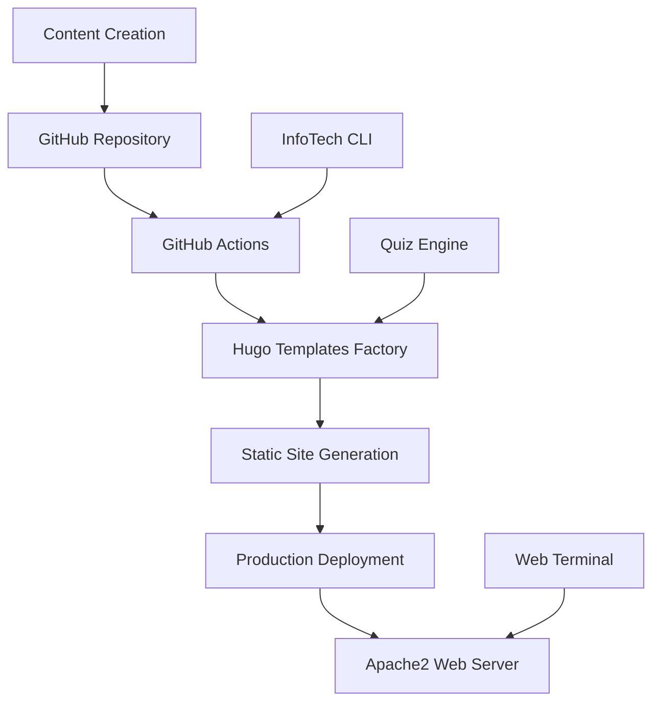

# Open Source at InfoTech.io

InfoTech.io is built on the principles of open source development. Every line of code, every piece of content, and every design decision is transparent and available for community contribution.

## 🌟 Why Open Source?

### Transparency
We believe that educational technology should be transparent. You can see exactly how our systems work, how content is created, and how decisions are made.

### Community-Driven Innovation
The best educational tools are created by communities of educators, learners, and developers working together. Open source enables this collaboration.

### Accessibility
By making everything open source, we ensure that high-quality educational resources remain accessible to everyone, everywhere.

### Quality Assurance
Open source development means more eyes on the code, better testing, and higher quality software.

## 🎯 Our Open Source Ecosystem

### GitHub Organization
All our projects live in our [GitHub organization](https://github.com/info-tech-io):

- **11+ Active Repositories**
- **100% Open Source Code**
- **MIT License** for maximum freedom
- **Active Community** of contributors

### Core Projects

#### Educational Platform
- [`infotecha`](https://github.com/info-tech-io/infotecha) - Main platform hub
- [`mod_linux_base`](https://github.com/info-tech-io/mod_linux_base) - Linux basics course
- [`mod_linux_advanced`](https://github.com/info-tech-io/mod_linux_advanced) - Advanced Linux course
- [`mod_linux_professional`](https://github.com/info-tech-io/mod_linux_professional) - Professional Linux course

#### Technology Infrastructure
- [`hugo-templates`](https://github.com/info-tech-io/hugo-templates) - Site generation framework
- [`quiz`](https://github.com/info-tech-io/quiz) - Interactive testing system
- [`web-terminal`](https://github.com/info-tech-io/web-terminal) - Browser-based terminal
- [`info-tech-cli`](https://github.com/info-tech-io/info-tech-cli) - Development automation tools

#### Supporting Tools
- [`mod_template`](https://github.com/info-tech-io/mod_template) - Template for new modules
- [`info-tech-io.github.io`](https://github.com/info-tech-io/info-tech-io.github.io) - Organization website

## 🚀 How to Contribute

### Quick Start for Contributors

1. **Choose Your Path**: [Developer Onboarding Guide](/open-source/onboarding/)
2. **Pick a Project**: Browse our [repositories](https://github.com/info-tech-io)
3. **Read the Docs**: Each project has comprehensive documentation
4. **Start Contributing**: Submit your first pull request

### Types of Contributions

#### 📝 Content Creation
- Write new educational modules
- Improve existing course content
- Create exercises and practical labs
- Develop quiz questions and assessments

#### 💻 Software Development
- Enhance platform functionality
- Fix bugs and improve performance
- Develop new features and tools
- Improve user experience

#### 📚 Documentation
- Write technical documentation
- Create tutorials and guides
- Improve API references
- Translate content to other languages

#### 🎨 Design & UX
- Improve visual design
- Enhance user experience
- Create graphics and illustrations
- Design new themes and templates

#### 🧪 Testing & Quality Assurance
- Test new features
- Report bugs and issues
- Improve automated testing
- Review pull requests

## 📋 Contribution Guidelines

### Before You Start
1. **Read our [Code of Conduct](https://github.com/info-tech-io/.github/blob/main/CODE_OF_CONDUCT.md)**
2. **Check existing issues** to avoid duplicating work
3. **Join our discussions** in GitHub Discussions
4. **Review the project roadmap** to understand priorities

### Development Workflow
1. **Fork** the repository you want to contribute to
2. **Create a branch** for your feature or fix
3. **Make your changes** following our coding standards
4. **Test thoroughly** and ensure all checks pass
5. **Submit a pull request** with a clear description
6. **Participate in code review** and address feedback

### Coding Standards

#### General Principles
- **Clean, readable code** with meaningful variable names
- **Comprehensive documentation** for all functions and modules
- **Test coverage** for new features and bug fixes
- **Consistent formatting** using project-specific style guides

#### Technology-Specific Guidelines

**JavaScript/Node.js**
- Use ES6+ features where appropriate
- Follow ESLint configuration
- Include JSDoc comments for functions
- Write unit tests with Jest

**Hugo/Markdown**
- Use semantic HTML structure
- Follow Hugo best practices
- Validate markdown syntax
- Include frontmatter metadata

**Shell Scripts**
- Use bash with `set -euo pipefail`
- Include usage documentation
- Handle errors gracefully
- Test on multiple environments

## 🏗️ Technical Architecture

### System Overview

### Key Technologies
- **Frontend**: Hugo, JavaScript, CSS, HTML
- **Backend**: Node.js, Python, Bash
- **Infrastructure**: Apache2, Docker, GitHub Actions
- **Development**: Git, GitHub, npm, Docker Compose

### Deployment Pipeline
1. **Content Update** → GitHub webhook
2. **CI/CD Trigger** → GitHub Actions workflow
3. **Build Process** → Hugo Templates Factory
4. **Quality Checks** → Automated testing
5. **Production Deploy** → Apache2 server
6. **Cache Invalidation** → CDN refresh

## 🎓 Learning Resources

### For New Contributors
- **[Developer Onboarding](/open-source/onboarding/)** - Start here!
- **[Architecture Overview](/open-source/architecture/)** - Understand our systems
- **[Contributing Guide](/open-source/contributing/)** - Detailed contribution process

### For Experienced Developers
- **[Technical Documentation](https://github.com/info-tech-io)** - Detailed API references
- **[Deployment Guides](/open-source/deployment/)** - Production deployment
- **[Performance Optimization](/open-source/performance/)** - Best practices

### Community Resources
- **[GitHub Discussions](https://github.com/orgs/info-tech-io/discussions)** - Community forum
- **[Project Boards](https://github.com/orgs/info-tech-io/projects)** - Current priorities
- **[Issue Tracking](https://github.com/info-tech-io)** - Bug reports and feature requests

## 🏆 Recognition & Rewards

### Contributor Recognition
- **GitHub Profile** highlighting in our repositories
- **Contributors Page** on our website
- **Social Media** shout-outs for significant contributions
- **Conference Speaking** opportunities for major contributors

### Contribution Levels

#### 🥉 Bronze Contributors
- First-time contributors
- Small bug fixes and documentation improvements
- Community participation

#### 🥈 Silver Contributors
- Regular contributors with multiple merged PRs
- Feature development and major bug fixes
- Code review participation

#### 🥇 Gold Contributors
- Long-term contributors with significant impact
- Architecture decisions and major feature development
- Mentoring new contributors

#### 💎 Core Contributors
- Maintainer status on key repositories
- Technical decision-making authority
- Project roadmap influence

## 📊 Community Stats

### Current Metrics
- **11+ Active Repositories**
- **100+ Issues and PRs** processed
- **3 Production Modules** deployed
- **4 Major Products** in development

### Growth Indicators
- **Monthly Active Contributors**: Growing steadily
- **Community Discussions**: Active and engaging
- **Code Quality**: Maintained at high standards
- **Documentation Coverage**: Comprehensive and up-to-date

## 🤝 Community Guidelines

### Communication Standards
- **Be respectful** and inclusive in all interactions
- **Provide constructive feedback** with specific suggestions
- **Ask questions** when you need clarification
- **Share knowledge** and help others learn

### Collaboration Best Practices
- **Start with discussions** before major changes
- **Keep pull requests focused** on single features or fixes
- **Respond to feedback** promptly and professionally
- **Test thoroughly** before submitting changes

## 🚀 Future Opportunities

### Upcoming Projects
- **Mobile Learning App** - React Native development
- **AI-Powered Tutoring** - Machine learning integration
- **Blockchain Certification** - Credential verification system
- **International Expansion** - Multi-language support

### Technology Expansions
- **Cloud Infrastructure** - Kubernetes and container orchestration
- **Real-time Collaboration** - WebRTC and collaborative editing
- **Analytics Platform** - Learning behavior analysis
- **API Ecosystem** - Third-party integrations

## 📞 Get In Touch

### Community Channels
- **GitHub Discussions**: [github.com/orgs/info-tech-io/discussions](https://github.com/orgs/info-tech-io/discussions)
- **Telegram Community**: [t.me/infotecha_ru](https://t.me/infotecha_ru)
- **Email**: developers@info-tech.io

### Contribution Help
- **New Contributor Guide**: [Start Here](/open-source/onboarding/)
- **Technical Questions**: Use GitHub Issues in relevant repositories
- **General Discussion**: GitHub Discussions
- **Urgent Issues**: Email developers@info-tech.io

---

## Ready to Contribute?

🎯 **[Start with our Developer Onboarding Guide](/open-source/onboarding/)**

Join us in building the future of open source education technology!

---

*InfoTech.io Open Source - By the community, for the community.*