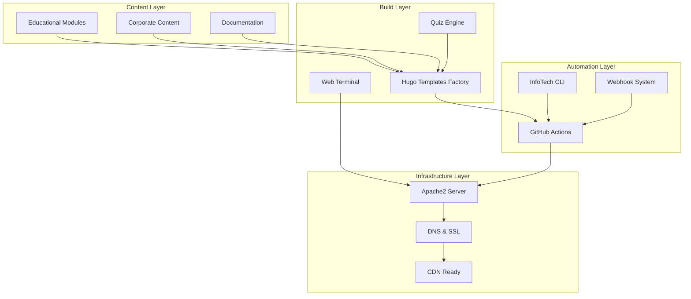
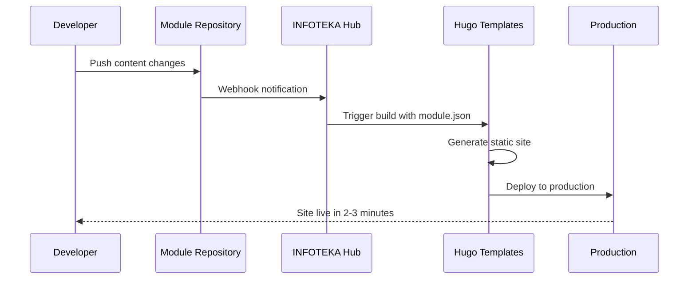
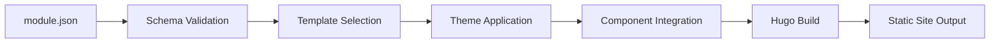
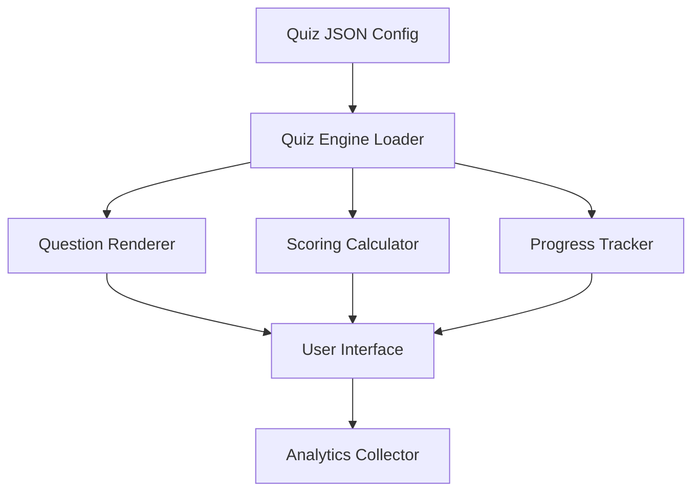
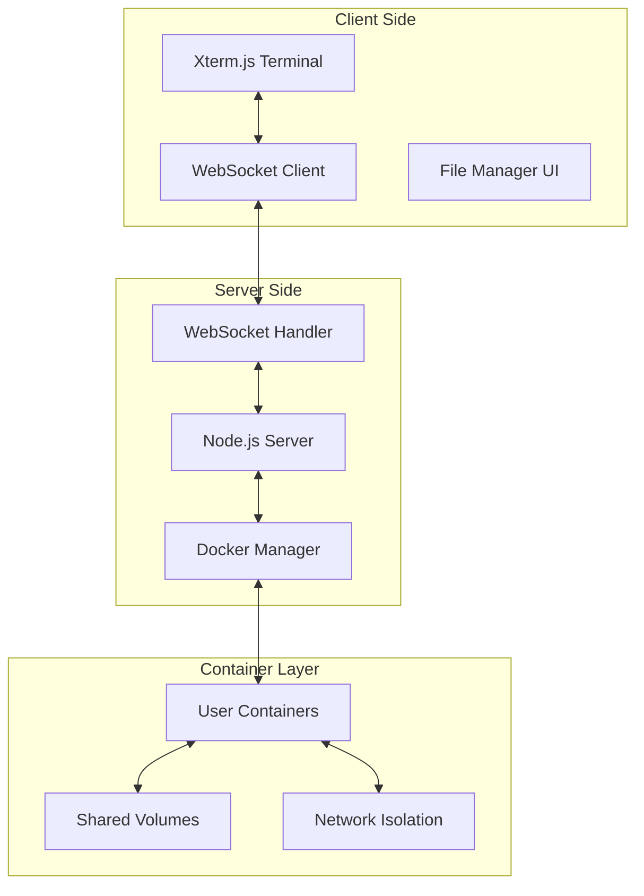
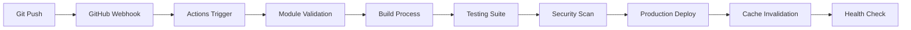
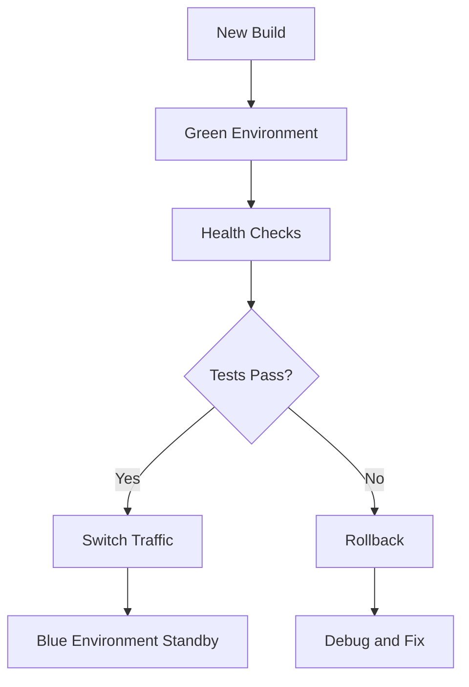
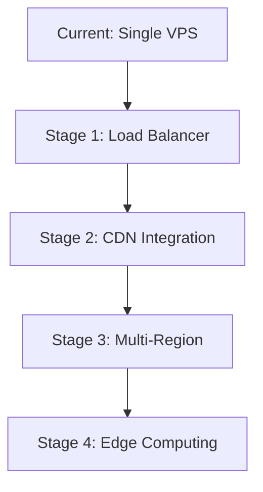

# InfoTech.io Technical Architecture

This document provides a comprehensive overview of InfoTech.io's technical architecture, design decisions, and implementation details for developers and contributors.

## 🏗️ System Overview

InfoTech.io implements a **decentralized, modular architecture** based on the "Hub and Spoke" pattern with static site generation and automated CI/CD pipelines.

### High-Level Architecture



## 🎯 Core Architectural Principles

### 1. Modular Design
Each component is independent and can be developed, tested, and deployed separately:
- **Educational modules** as separate repositories
- **Build tools** as reusable packages
- **Infrastructure components** as isolated services

### 2. Static-First Approach
All content is generated as static HTML for optimal performance:
- **No server-side processing** required for content delivery
- **CDN-friendly** architecture for global distribution
- **Security through simplicity** - no dynamic vulnerabilities

### 3. Open Source Transparency
Every component is open source with clear interfaces:
- **Public repositories** for all code and content
- **Documented APIs** for all integrations
- **Community-driven** development process

### 4. Automation-First
Human intervention is minimized through automation:
- **Automated testing** for all changes
- **Automatic deployment** from commits
- **Self-updating** documentation and dependencies

## 🏛️ Component Architecture

### Educational Platform (INFOTEKA)

#### Repository Structure
```
infotecha.ru/
├── Main Platform Hub
├── Module Registry
└── Deployment Orchestration

mod_*/
├── Educational Content
├── Quiz Configurations
├── Module Metadata (module.json)
└── CI/CD Workflows
```

#### Content Flow


### Hugo Templates Factory

#### Architecture Overview
```
hugo-templates/
├── templates/           # Site templates (educational, corporate, docs)
├── themes/             # Visual themes (compose, minimal, custom)
├── components/         # Reusable components (quiz, search, nav)
├── schemas/           # JSON validation schemas
├── scripts/           # Build and automation scripts
└── package.json       # CLI package configuration
```

#### Template System


#### Build Process
1. **Configuration Reading**: Parse `module.json` for build parameters
2. **Schema Validation**: Ensure configuration meets requirements
3. **Template Assembly**: Combine template + theme + components
4. **Content Processing**: Transform Markdown to HTML with Hugo
5. **Asset Optimization**: Minify CSS/JS, optimize images
6. **Output Generation**: Create production-ready static site

### Quiz Engine

#### Technical Architecture
```javascript
// Core Quiz Engine Structure
class QuizEngine {
  constructor(config) {
    this.questions = config.questions;
    this.scoring = new ScoringSystem(config.scoring);
    this.ui = new QuizUI(config.ui);
    this.analytics = new Analytics(config.analytics);
  }

  async loadQuiz(quizId) {
    const config = await fetch(`/quizzes/${quizId}.json`);
    return new Quiz(config);
  }
}
```

#### Integration Patterns


#### Question Types Implementation
```typescript
interface Question {
  id: string;
  type: 'multiple_choice' | 'true_false' | 'fill_blank' | 'code_review';
  question: string;
  options?: string[];
  correct: number | string | boolean;
  explanation?: string;
  points?: number;
  timeLimit?: number;
}
```

### Web Terminal

#### System Architecture


#### Security Model
```yaml
Container Security:
  - Isolated user namespaces
  - Resource limits (CPU, memory, disk)
  - Network restrictions
  - No privileged operations
  - Temporary file systems
  - Automatic cleanup after session

Session Management:
  - JWT-based authentication
  - Session timeouts
  - Rate limiting
  - Input sanitization
  - Command filtering
```

## 🔄 CI/CD Pipeline Architecture

### Workflow Overview


### GitHub Actions Workflows

#### Module Update Workflow
```yaml
# .github/workflows/module-updated.yml
name: Module Content Updated

on:
  repository_dispatch:
    types: [module-updated]

jobs:
  build-and-deploy:
    runs-on: ubuntu-latest
    steps:
      - name: Checkout hugo-templates
        uses: actions/checkout@v4
        with:
          repository: info-tech-io/hugo-templates
          token: ${{ secrets.PAT_TOKEN }}

      - name: Get module configuration
        run: |
          MODULE_REPO="${{ github.event.client_payload.repository }}"
          curl -H "Authorization: token ${{ secrets.PAT_TOKEN }}" \
               "https://api.github.com/repos/${MODULE_REPO}/contents/module.json" \
               | jq -r .content | base64 -d > module.json

      - name: Build site
        run: |
          npm install
          chmod +x scripts/build.sh
          scripts/build.sh --config module.json --deploy production
```

#### Quality Assurance Pipeline
```yaml
# Automated quality checks
Quality Gates:
  - Schema validation for module.json
  - Markdown linting for content
  - Link checking for all URLs
  - Performance testing for generated sites
  - Security scanning for dependencies
  - Accessibility auditing
```

### Deployment Strategy

#### Blue-Green Deployment


## 🌐 Infrastructure Architecture

### Network Architecture
```
Domain Structure:
├── infotecha.ru (Main Platform)
├── *.infotecha.ru (Educational Modules)
├── info-tech.io (Corporate Site)
└── *.info-tech.io (Product Documentation)

SSL/TLS:
├── Let's Encrypt Wildcard Certificates
├── Automatic Renewal via Certbot
├── HSTS and Security Headers
└── Grade A+ SSL Configuration
```

### Server Configuration

#### Apache2 Virtual Host Setup
```apache
<VirtualHost *:443>
    ServerName infotecha.ru
    ServerAlias *.infotecha.ru
    DocumentRoot /var/www/infotecha.ru

    # Dynamic subdomain routing
    RewriteEngine On
    RewriteCond %{HTTP_HOST} ^([^.]+)\.infotecha\.ru$
    RewriteRule ^(.*)$ /%1/$1 [L]

    # Security headers
    Header always set Strict-Transport-Security "max-age=31536000; includeSubDomains"
    Header always set X-Frame-Options "SAMEORIGIN"
    Header always set X-Content-Type-Options "nosniff"
    Header always set Referrer-Policy "strict-origin-when-cross-origin"

    # SSL configuration
    SSLEngine on
    SSLCertificateFile /etc/letsencrypt/live/infotecha.ru/fullchain.pem
    SSLCertificateKeyFile /etc/letsencrypt/live/infotecha.ru/privkey.pem

    # Modern SSL configuration
    SSLProtocol all -SSLv3 -TLSv1 -TLSv1.1
    SSLCipherSuite ECDHE-ECDSA-AES128-GCM-SHA256:ECDHE-RSA-AES128-GCM-SHA256
    SSLHonorCipherOrder off
</VirtualHost>
```

#### File System Structure
```
/var/www/
├── infotecha.ru/
│   ├── index.html (Main hub)
│   ├── linux-base/ (Educational module)
│   ├── linux-advanced/
│   ├── linux-professional/
│   └── assets/ (Shared resources)
├── info-tech.io/
│   ├── index.html (Corporate site)
│   ├── quiz/ (Quiz Engine docs)
│   ├── hugo/ (Hugo Templates docs)
│   ├── terminal/ (Web Terminal docs)
│   └── cli/ (InfoTech CLI docs)
└── logs/
    ├── access.log
    ├── error.log
    └── ssl_request.log
```

### Monitoring and Observability

#### System Monitoring
```yaml
Metrics Collection:
  - Server resources (CPU, memory, disk)
  - Web server performance (response times, error rates)
  - SSL certificate expiration monitoring
  - DNS resolution monitoring
  - CDN cache hit rates

Alerting:
  - Site downtime alerts
  - Performance degradation warnings
  - Security certificate expiration
  - Build failure notifications
  - Anomalous traffic patterns

Logging:
  - Structured JSON logs
  - Centralized log aggregation
  - Error tracking and analysis
  - User behavior analytics
```

## 🔒 Security Architecture

### Security Layers

#### 1. Infrastructure Security
```yaml
Server Hardening:
  - UFW firewall (ports 22, 80, 443 only)
  - SSH key authentication only
  - Automatic security updates
  - Fail2ban for brute force protection
  - Regular vulnerability scanning

SSL/TLS Security:
  - Modern cipher suites only
  - Perfect Forward Secrecy
  - HSTS with preloading
  - Certificate transparency monitoring
```

#### 2. Application Security
```yaml
Static Site Security:
  - No server-side code execution
  - Content Security Policy headers
  - Subresource Integrity for external resources
  - XSS protection headers
  - Input sanitization in Quiz Engine

API Security:
  - Rate limiting on all endpoints
  - JWT authentication for Web Terminal
  - CORS policies properly configured
  - Input validation and sanitization
```

#### 3. Development Security
```yaml
Code Security:
  - Dependency vulnerability scanning
  - Static analysis security testing
  - Secrets scanning in repositories
  - Security code review requirements
  - Regular security audits

CI/CD Security:
  - Signed commits verification
  - Secure secrets management
  - Build environment isolation
  - Artifact integrity verification
```

### Threat Model

#### Identified Threats and Mitigations
1. **DDoS Attacks**
   - Mitigation: CloudFlare CDN with DDoS protection
   - Rate limiting at multiple levels

2. **Content Injection**
   - Mitigation: Static site generation eliminates server-side injection
   - Content validation in CI/CD pipeline

3. **Supply Chain Attacks**
   - Mitigation: Dependency pinning and vulnerability scanning
   - Secure package management practices

4. **Social Engineering**
   - Mitigation: Multi-factor authentication for maintainers
   - Security awareness training

## 📊 Performance Architecture

### Performance Optimization Strategy

#### Frontend Performance
```yaml
Loading Speed Optimization:
  - Static site generation for instant serving
  - Minified CSS and JavaScript
  - Optimized images with WebP format
  - Critical CSS inlining
  - Resource preloading and prefetching

Rendering Performance:
  - Minimal JavaScript usage
  - Progressive enhancement approach
  - Lazy loading for non-critical content
  - Service worker for offline functionality
```

#### Backend Performance
```yaml
Server Performance:
  - Apache2 with mod_deflate compression
  - Browser caching with appropriate headers
  - HTTP/2 support for multiplexing
  - Keep-alive connections

Build Performance:
  - Incremental builds for unchanged content
  - Parallel processing where possible
  - Build caching for dependencies
  - Optimized Docker layers
```

### Performance Monitoring

#### Core Web Vitals Tracking
```javascript
// Performance monitoring implementation
const observer = new PerformanceObserver((list) => {
  for (const entry of list.getEntries()) {
    if (entry.entryType === 'largest-contentful-paint') {
      console.log('LCP:', entry.startTime);
    }
    if (entry.entryType === 'first-input') {
      console.log('FID:', entry.processingStart - entry.startTime);
    }
    if (entry.entryType === 'layout-shift') {
      console.log('CLS:', entry.value);
    }
  }
});

observer.observe({entryTypes: ['largest-contentful-paint', 'first-input', 'layout-shift']});
```

## 🚀 Scalability Architecture

### Horizontal Scaling Strategy

#### Current Capacity
- **Single VPS**: Handles current traffic efficiently
- **Static content**: Minimal server resources required
- **Build processes**: Handled by GitHub Actions

#### Scaling Plan


#### Implementation Steps
1. **Load Balancer**: Nginx reverse proxy for multiple Apache instances
2. **CDN Integration**: CloudFlare or AWS CloudFront for global distribution
3. **Database**: Redis for session management and caching
4. **Microservices**: Separate services for Quiz Engine and Web Terminal

### Technology Evolution Path

#### Current Stack → Future Stack
```yaml
Static Site Generation:
  Current: Hugo with Apache2
  Future: Hugo with Nginx + Redis + CDN

Content Management:
  Current: Git-based workflow
  Future: Git + Headless CMS integration

Interactive Features:
  Current: Client-side JavaScript
  Future: Edge computing with Workers

Analytics:
  Current: Basic logging
  Future: Real-time analytics with ML insights
```

## 🔧 Developer Experience Architecture

### Local Development Environment

#### Setup Automation
```bash
#!/bin/bash
# dev-setup.sh - One-command development setup

# Clone all repositories
gh repo clone info-tech-io/hugo-templates
gh repo clone info-tech-io/quiz
gh repo clone info-tech-io/web-terminal
gh repo clone info-tech-io/info-tech-cli

# Install dependencies
for dir in */; do
  if [ -f "$dir/package.json" ]; then
    (cd "$dir" && npm install)
  fi
done

# Setup environment variables
cp .env.example .env
echo "Development environment ready!"
```

#### Development Tools Integration
```yaml
VS Code Extensions:
  - Hugo Language Support
  - Markdown All in One
  - GitLens
  - ESLint
  - Prettier

Git Hooks:
  - Pre-commit: Linting and formatting
  - Pre-push: Test suite execution
  - Commit-msg: Conventional commit validation

Docker Compose:
  - Local Hugo server
  - Quiz Engine development
  - Web Terminal testing
  - Database services
```

### API Design Philosophy

#### RESTful API Principles
```yaml
Endpoint Design:
  - Resource-based URLs
  - HTTP method semantics
  - Consistent response formats
  - Proper status codes

Versioning Strategy:
  - URL versioning: /api/v1/
  - Backward compatibility maintenance
  - Deprecation warnings
  - Migration guides

Documentation:
  - OpenAPI/Swagger specifications
  - Interactive API explorer
  - Code examples in multiple languages
  - SDK generation
```

## 📚 Documentation Architecture

### Documentation Strategy

#### Multi-Level Documentation
```
├── User Documentation (infotecha.ru)
│   ├── Course content and tutorials
│   ├── Getting started guides
│   └── Frequently asked questions
├── Developer Documentation (info-tech.io)
│   ├── API references
│   ├── Architecture overviews
│   └── Contributing guidelines
├── Technical Documentation (GitHub)
│   ├── README files
│   ├── Code comments
│   └── Architecture Decision Records
└── Operational Documentation (Private)
    ├── Deployment procedures
    ├── Incident response plans
    └── Monitoring runbooks
```

#### Documentation as Code
```yaml
Automation:
  - Auto-generated API docs from code
  - Automated link checking
  - Screenshot automation for UI docs
  - Version synchronization

Quality Assurance:
  - Technical writing review process
  - User testing of documentation
  - Analytics on documentation usage
  - Regular content audits
```

## 🔮 Future Architecture Considerations

### Technology Roadmap

#### Next 6 Months
- **CDN Integration**: CloudFlare implementation
- **API Gateway**: Centralized API management
- **Monitoring**: Comprehensive observability stack
- **Mobile App**: Progressive Web App development

#### Next 12 Months
- **Microservices**: Service decomposition
- **Container Orchestration**: Kubernetes migration
- **Real-time Features**: WebSocket infrastructure
- **AI Integration**: Machine learning capabilities

#### Next 24 Months
- **Edge Computing**: Global edge deployment
- **Blockchain Integration**: Certificate verification
- **IoT Support**: Hardware lab integration
- **AR/VR**: Immersive learning experiences

### Architectural Decision Records (ADRs)

#### ADR-001: Static Site Generation Choice
**Decision**: Use Hugo for static site generation
**Rationale**: Performance, security, and simplicity
**Consequences**: Limited dynamic functionality, excellent caching

#### ADR-002: Modular Repository Structure
**Decision**: Separate repositories for each module
**Rationale**: Independent development and deployment
**Consequences**: More complex coordination, better isolation

#### ADR-003: GitHub Actions for CI/CD
**Decision**: Use GitHub Actions instead of external CI/CD
**Rationale**: Integration with GitHub, cost-effectiveness
**Consequences**: Vendor lock-in, excellent developer experience

## 📞 Architecture Support

### Getting Help with Architecture

#### Questions and Discussions
- **GitHub Discussions**: Architecture category
- **Telegram**: #architecture channel
- **Email**: architecture@info-tech.io

#### Contributing to Architecture
- **RFC Process**: Request for Comments on major changes
- **Architecture Review**: Mandatory for significant changes
- **Documentation**: Update ADRs for all decisions

---

*This architecture document is maintained by the InfoTech.io community and updated with each major release.*