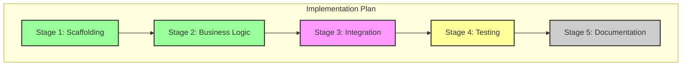

# Contributing to InfoTech.io

Thank you for your interest in contributing to InfoTech.io! This guide provides detailed information on how to contribute effectively to our open source educational technology ecosystem.

## 🎯 Quick Contribution Guide

### First Time Contributors
1. **Read our [Code of Conduct](https://github.com/info-tech-io/.github/blob/main/CODE_OF_CONDUCT.md)**
2. **Join our [GitHub Discussions](https://github.com/orgs/info-tech-io/discussions)**
3. **Find a "good first issue"** in any repository
4. **Follow our [Developer Onboarding Guide](/open-source/onboarding/)**

### Experienced Contributors
1. **Review current [Project Boards](https://github.com/orgs/info-tech-io/projects)**
2. **Participate in [Architecture Discussions](https://github.com/orgs/info-tech-io/discussions/categories/architecture)**
3. **Propose new features** via GitHub Issues
4. **Mentor newcomers** in the community

## 📋 Types of Contributions

### 1. Educational Content
**Help create and improve learning materials**

#### Course Content
- Write new lessons and tutorials
- Improve existing content for clarity
- Create practical exercises and labs
- Develop assessment questions

#### Content Guidelines
```markdown
# Lesson Structure Template

## Learning Objectives
- What students will learn
- Skills they will gain
- Knowledge they will acquire

## Prerequisites
- Required knowledge
- Recommended experience
- Preparation steps

## Content
### Introduction
### Core Concepts
### Practical Examples
### Hands-on Exercise

## Assessment
- Quiz questions
- Practical challenges
- Further reading

## Summary
- Key takeaways
- Next steps
```

#### Quality Standards
- **Clarity**: Content should be understandable by the target audience
- **Accuracy**: All technical information must be correct and up-to-date
- **Completeness**: Cover topics thoroughly with examples
- **Accessibility**: Use inclusive language and consider diverse learning styles

### 2. Software Development
**Contribute to our technology stack**

#### Platform Development (JavaScript/Hugo)
```bash
# Setup for platform development
git clone https://github.com/info-tech-io/infotecha.git
cd infotecha
npm install
npm run dev
```

#### Quiz Engine (JavaScript)
```bash
# Setup for Quiz Engine development
git clone https://github.com/info-tech-io/quiz.git
cd quiz
npm install
npm test
npm run dev
```

#### Hugo Templates (Node.js/Hugo)
```bash
# Setup for Hugo Templates development
git clone https://github.com/info-tech-io/hugo-templates.git
cd hugo-templates
npm install
npm run test
./scripts/build.sh --help
```

#### Development Standards
- **Code Quality**: Clean, readable, maintainable code
- **Testing**: Comprehensive test coverage for new features
- **Documentation**: Clear comments and updated README files
- **Performance**: Consider impact on loading speed and resource usage

### 3. Documentation
**Improve and expand our documentation**

#### Types of Documentation
- **User Guides**: Help users understand and use our products
- **Developer Docs**: Technical documentation for contributors
- **API References**: Detailed API documentation
- **Tutorials**: Step-by-step learning guides

#### Documentation Standards
```markdown
# Documentation Template

## Title (Clear and Descriptive)

### Overview
Brief description of what this document covers

### Prerequisites
What readers should know before reading

### Main Content
- Clear headings and structure
- Code examples with explanations
- Screenshots where helpful
- Links to related documentation

### Examples
Practical examples with expected outputs

### Troubleshooting
Common issues and solutions

### Next Steps
What to read or do next
```

### 4. Design and User Experience
**Enhance visual design and usability**

#### Design Contributions
- **UI/UX Improvements**: Better user interfaces and experiences
- **Visual Identity**: Logos, icons, and brand consistency
- **Accessibility**: Ensure products work for all users
- **Mobile Experience**: Responsive design improvements

#### Design Guidelines
- **Accessibility First**: Follow WCAG 2.1 AA standards
- **Performance**: Optimize images and assets
- **Consistency**: Follow established design patterns
- **User-Centered**: Design based on user research and feedback

### 5. Community Building
**Help grow and nurture our community**

#### Community Contributions
- **Mentoring**: Help new contributors get started
- **Event Organization**: Organize meetups, hackathons, webinars
- **Content Creation**: Blog posts, videos, podcasts
- **Translation**: Translate content to other languages

## 🔄 Contribution Workflow

> **📚 For a comprehensive, step-by-step guide** with detailed examples, commit sequences, Mermaid diagrams, and templates, see our **[Complete Issue and Commit Workflow Guide](/open-source/issue-commit-workflow/)**.

### Epic Issues + Child Issues + Feature Branches Strategy

For complex, multi-week development tasks, InfoTech.io follows an industry-standard workflow that ensures traceability, systematic progress tracking, and manageable development cycles. This process mandates the creation of detailed, version-controlled implementation plans before coding begins.

#### When to Use This Workflow
- **Large Features**: Development tasks requiring 4+ days of work
- **System Overhauls**: Fundamental refactoring or architecture changes
- **Multi-Component Changes**: Work spanning multiple repositories or modules
- **Critical Infrastructure**: CI/CD, build systems, deployment pipelines
- **Major Bug Fixes**: Complex issues requiring extensive testing and validation

#### Workflow Structure

##### 1. Epic Issue Creation
Create a comprehensive Epic Issue in the primary repository that serves as the central coordination point. Use the standard "Epic Issue Template" for this.

##### 2. Child Issues Creation
Break down the epic into specific, actionable child issues. Each child issue should represent a logical, self-contained block of work. Use the "Child Issue Template".

##### 3. Implementation Proposal (Design Phase)
This is a mandatory step before any code is written. The goal is to create a detailed, reviewable plan. All proposals are stored in the `docs/proposals` directory of the relevant repository.

###### Directory Structure
A dedicated directory must be created for each Epic or standalone Issue to house all related design documents.

**For an Epic Issue:**
The structure is nested to reflect the parent-child relationship.

```
docs/proposals/
└── epic-[epic_number]-[epic-title-slug]/
    ├── progress.md  (Overall Epic visualization)
    ├── child-[child_number]-[child-title-slug]/
    │   ├── design.md
    │   ├── progress.md
    │   ├── 001-step-one.md
    │   └── 002-step-two.md
    └── child-[another_child_number]-[another-title-slug]/
        └── ...
```

**For a standalone Issue:**
The structure is simpler.

```
docs/proposals/
└── [issue_number]-[issue-title-slug]/
    ├── design.md
    ├── progress.md
    ├── 001-step-one.md
    └── 002-step-two.md
```

###### Proposal Documents
- **`design.md`**: The high-level implementation plan. This document outlines the major stages of work, corresponding to the future Pull Request's scope. It should contain:
    - A clear problem statement.
    - A description of the proposed technical solution.
    - A list of high-level implementation stages (e.g., "1. Refactor module X", "2. Implement feature Y", "3. Add test coverage").
    - Links to the detailed step files (`001-*.md`, etc.).

- **`00X-step-name.md`**: Detailed, step-by-step action plans. Each file corresponds to a high-level stage from `design.md`. It breaks the stage down into concrete actions, where each action ideally results in a single, atomic commit.
    - **After a step is completed, this file MUST be updated with a "Done" status and a direct link to the commit that implemented it.**

- **`progress.md`**: A visualization of the implementation progress using Mermaid.js. This file acts as a live dashboard for the Issue.
    - For Epics, it visualizes the status of its Child Issues.
    - For Child/standalone Issues, it visualizes the status of the implementation stages from `design.md`.
    - **This file MUST be updated as stages are completed.**

###### Example `progress.md` for a Child Issue:
```markdown
# Progress: [Issue Title]


*This graph shows Stage 1 & 2 as completed, Stage 3 as in-progress, Stage 4 as planned, and Stage 5 as not started.*
```

###### Design Review Process
1.  Before writing implementation code, the contributor creates the necessary proposal directory and files (`design.md`, `progress.md`, `00X-*.md`).
2.  A **Draft Pull Request** is opened. The only changes in this PR are the new files in `docs/proposals/`.
3.  The team reviews the **plan**, not the code. This is a critical quality gate to catch architectural issues early.
4.  Once the plan is approved, the Design PR is merged into the `epic/...` branch (or `main` for standalone issues).

##### 4. Epic Branch Strategy
Create a long-lived epic branch that serves as the integration point:

```bash
# Epic branch creation and management
git checkout main
git pull origin main
git checkout -b epic/build-system-v2.0
```

##### 5. Development and Integration Cycle
Follow this systematic development pattern for each child issue:

```bash
# For each child issue:

# 1. Ensure the Implementation Proposal is approved and merged.

# 2. Create feature branch from the epic branch
git checkout epic/[epic-name]
git pull origin epic/[epic-name]
git checkout -b feature/[specific-task]

# 3. Implement a specific action from a detailed step file (e.g., 001-step-one.md)
# Focus only on this action.

# 4. Commit your changes with a clear message referencing the issue.
git commit -m "feat: implement error constants for #3"
git push origin feature/[specific-task]

# 5. (CRITICAL) Update the proposal documents
#    - Edit the corresponding step file (e.g., `001-step-one.md`) to mark the action as complete
#      and add a link to your commit hash.
#    - Edit `progress.md` to update the visualization.
#    - Commit these documentation changes.
git add docs/proposals/
git commit -m "docs: update progress for step 1.1 on #3"
git push

# 6. Repeat steps 3-5 until a full stage is complete.

# 7. Create a PR to the epic branch
# Title: "feat: [specific task] (#child-issue-number)"
# The PR should contain both implementation and documentation changes.

# 8. Code review and merge to epic branch.

# 9. Once all child issues are complete, create the final PR: epic branch → main.
# This PR will be a comprehensive summary of all work done.
```

#### Benefits of This Approach**:
- **Full Traceability**: Complete, version-controlled history from problem to plan to code.
- **Proactive Reviews**: Architectural decisions are reviewed before implementation, saving time.
- **Living Documentation**: The `docs/proposals` directory becomes a self-updating knowledge base.
- **Enhanced Visibility**: Mermaid diagrams provide an at-a-glance view of progress for all stakeholders.
- **Clarity of Scope**: Developers work from a pre-approved, detailed plan, reducing ambiguity.

#### Quality Gates and Reviews

##### Design Proposal Review
- [ ] Proposal directory structure is correct.
- [ ] `design.md` clearly outlines the solution and high-level stages.
- [ ] Detailed steps (`00X-*.md`) are logical and actionable.
- [ ] `progress.md` visualization accurately reflects the plan.

##### Child Issue PR Reviews
- [ ] Code changes align with the approved design documents.
- [ ] All commits are linked back from the design documents.
- [ ] The `progress.md` file has been correctly updated.
- [ ] Standard code quality and testing requirements are met.

##### Epic Integration Review
- [ ] All child issues are completed and tested.
- [ ] All proposal documents are finalized.
- [ ] Epic branch has comprehensive integration tests.
- [ ] Final `progress.md` for the epic shows 100% completion.


### 1. Planning Phase

#### Before You Start
1. **Search existing issues** to avoid duplicate work
2. **Discuss significant changes** in GitHub Discussions
3. **Create an issue** for new features or bugs (or Epic Issue for complex work)
4. **Get feedback** from maintainers before starting large changes

#### Issue Templates
```markdown
# Bug Report Template
**Description**: Brief description of the bug
**Steps to Reproduce**:
1. Step 1
2. Step 2
3. Step 3

**Expected Behavior**: What should happen
**Actual Behavior**: What actually happens
**Environment**: Browser, OS, version info
**Screenshots**: If applicable

# Feature Request Template
**Problem**: What problem does this solve?
**Solution**: Proposed solution
**Alternatives**: Other solutions considered
**Additional Context**: Any other relevant information
```

### 2. Development Phase

#### Setting Up Your Environment
```bash
# Fork the repository on GitHub
# Clone your fork
git clone https://github.com/YOUR_USERNAME/REPO_NAME.git
cd REPO_NAME

# Add upstream remote
git remote add upstream https://github.com/info-tech-io/REPO_NAME.git

# Create a feature branch
git checkout -b feature/your-feature-name

# Make your changes
# Test your changes
# Commit your changes
git commit -m "feat: add new feature description"

# Push to your fork
git push origin feature/your-feature-name
```

#### Development Best Practices
- **Small, Focused Changes**: Keep PRs small and focused on one feature/fix
- **Regular Commits**: Make atomic commits with clear messages
- **Keep Updated**: Regularly sync with upstream changes
- **Test Locally**: Thoroughly test before submitting

### 3. Submission Phase

#### Pull Request Guidelines
```markdown
# Pull Request Template

## Description
Brief description of changes made

## Type of Change
- [ ] Bug fix (non-breaking change which fixes an issue)
- [ ] New feature (non-breaking change which adds functionality)
- [ ] Breaking change (fix or feature that would cause existing functionality to not work as expected)
- [ ] Documentation update

## How Has This Been Tested?
- [ ] Unit tests
- [ ] Integration tests
- [ ] Manual testing
- [ ] Cross-browser testing (if applicable)

## Checklist
- [ ] My code follows the style guidelines of this project
- [ ] I have performed a self-review of my own code
- [ ] I have commented my code, particularly in hard-to-understand areas
- [ ] I have made corresponding changes to the documentation
- [ ] My changes generate no new warnings
- [ ] I have added tests that prove my fix is effective or that my feature works
- [ ] New and existing unit tests pass locally with my changes
```

#### Code Review Process
1. **Automated Checks**: CI/CD pipeline runs tests and quality checks
2. **Peer Review**: Other contributors review your code
3. **Maintainer Review**: Project maintainers provide final approval
4. **Merge**: Changes are merged into the main branch

### 4. Post-Merge Phase

#### After Your PR is Merged
- **Monitor**: Watch for any issues in production
- **Documentation**: Update documentation if needed
- **Communication**: Share your contribution with the community
- **Follow-up**: Address any reported issues quickly

## 📏 Quality Standards

### Code Quality

#### JavaScript/Node.js Standards
```javascript
// Use modern ES6+ features
const fetchUserData = async (userId) => {
  try {
    const response = await fetch(`/api/users/${userId}`);
    if (!response.ok) {
      throw new Error(`HTTP error! status: ${response.status}`);
    }
    return await response.json();
  } catch (error) {
    console.error('Failed to fetch user data:', error);
    throw error;
  }
};

// Use meaningful variable names
const isUserAuthenticated = checkAuthStatus();
const userPreferences = getUserPreferences();

// Document complex functions
/**
 * Calculates quiz score based on correct answers and time taken
 * @param {Array} answers - Array of user answers
 * @param {Array} correctAnswers - Array of correct answers
 * @param {number} timeLimit - Time limit in seconds
 * @param {number} timeTaken - Time taken in seconds
 * @returns {Object} Score object with points and percentage
 */
function calculateQuizScore(answers, correctAnswers, timeLimit, timeTaken) {
  // Implementation here
}
```

#### CSS/Styling Standards
```css
/* Use semantic class names */
.quiz-container {
  display: flex;
  flex-direction: column;
  gap: 1rem;
}

.question-card {
  padding: 1.5rem;
  border: 1px solid var(--border-color);
  border-radius: 0.5rem;
  background-color: var(--card-background);
}

/* Follow mobile-first responsive design */
@media (min-width: 768px) {
  .quiz-container {
    flex-direction: row;
  }
}

/* Use CSS custom properties for theming */
:root {
  --primary-color: #007bff;
  --secondary-color: #6c757d;
  --success-color: #28a745;
  --error-color: #dc3545;
}
```

#### Markdown/Content Standards
```markdown
---
title: "Clear, Descriptive Title"
description: "Brief description for SEO and navigation"
date: 2025-09-23
weight: 10
tags: ["relevant", "tags"]
---

# Main Heading (H1)

Brief introduction paragraph explaining what this content covers.

## Section Heading (H2)

Content organized in logical sections with clear headings.

### Subsection (H3)

- Use bullet points for lists
- Keep paragraphs concise
- Include code examples where relevant

```bash
# Code blocks should include language specification
echo "Example command"
```

> Use blockquotes for important notes or warnings

[Include relevant links](https://example.com) with descriptive text.
```

### Testing Standards

#### Unit Testing Requirements
```javascript
// Example Jest test
describe('QuizEngine', () => {
  let quizEngine;

  beforeEach(() => {
    quizEngine = new QuizEngine({
      questions: mockQuestions,
      scoring: { pointsPerQuestion: 10 }
    });
  });

  test('should calculate correct score for all correct answers', () => {
    const answers = ['A', 'B', 'C'];
    const score = quizEngine.calculateScore(answers);

    expect(score.totalPoints).toBe(30);
    expect(score.percentage).toBe(100);
  });

  test('should handle empty answers gracefully', () => {
    const answers = [];
    const score = quizEngine.calculateScore(answers);

    expect(score.totalPoints).toBe(0);
    expect(score.percentage).toBe(0);
  });
});
```

#### Testing Coverage Requirements
- **Unit Tests**: 80%+ code coverage for new features
- **Integration Tests**: Test component interactions
- **End-to-End Tests**: Test critical user journeys
- **Performance Tests**: Ensure acceptable performance metrics

## 🔧 Tools and Resources

### Development Tools

#### Required Tools
- **Git**: Version control
- **Node.js 16+**: JavaScript runtime
- **Hugo Extended**: Static site generator
- **Text Editor**: VS Code recommended with extensions:
  - ESLint
  - Prettier
  - Hugo Language Support
  - Markdown All in One

#### Optional Tools
- **Docker**: Containerized development
- **GitHub CLI**: Enhanced GitHub integration
- **Postman**: API testing
- **Lighthouse**: Performance auditing

### Useful Resources

#### Learning Resources
- **Hugo Documentation**: [gohugo.io/documentation](https://gohugo.io/documentation/)
- **JavaScript MDN**: [developer.mozilla.org](https://developer.mozilla.org/en-US/docs/Web/JavaScript)
- **Git Tutorial**: [git-scm.com/book](https://git-scm.com/book)
- **Markdown Guide**: [markdownguide.org](https://markdownguide.org/)

#### InfoTech.io Specific
- **[Architecture Overview](/open-source/architecture/)**
- **[Developer Onboarding](/open-source/onboarding/)**
- **[Project Roadmap](/about/roadmap/)**
- **[GitHub Discussions](https://github.com/orgs/info-tech-io/discussions)**

## 🏆 Recognition and Rewards

### Contribution Recognition

#### Public Recognition
- **Contributors Page**: Featured on our website
- **GitHub Profile**: Highlighted in repository contributors
- **Social Media**: Shout-outs for significant contributions
- **Blog Features**: Guest posts about your contributions

#### Contribution Levels
- **First-time Contributor**: Welcome package and mentorship
- **Regular Contributor**: GitHub badges and community status
- **Core Contributor**: Repository permissions and decision input
- **Maintainer**: Project leadership and technical authority

### Community Rewards

#### Tangible Benefits
- **Swag**: InfoTech.io stickers, t-shirts, hoodies
- **Conference Tickets**: For significant contributors
- **Hardware**: Development tools for core contributors
- **References**: Job reference letters

#### Learning Opportunities
- **Mentorship**: Learn from experienced developers
- **Skills Development**: Gain experience with modern technologies
- **Portfolio Building**: Build a strong open source portfolio
- **Networking**: Connect with the global developer community

## 🚨 Common Pitfalls and Solutions

### Avoiding Common Mistakes

#### Code Issues
```javascript
// ❌ Bad: Unclear variable names
const d = new Date();
const u = users.filter(x => x.a);

// ✅ Good: Clear, descriptive names
const currentDate = new Date();
const activeUsers = users.filter(user => user.isActive);

// ❌ Bad: No error handling
const data = await fetch('/api/data');
const result = data.json();

// ✅ Good: Proper error handling
try {
  const response = await fetch('/api/data');
  if (!response.ok) {
    throw new Error(`HTTP error! status: ${response.status}`);
  }
  const data = await response.json();
  return data;
} catch (error) {
  console.error('Failed to fetch data:', error);
  throw error;
}
```

#### Documentation Issues
```markdown
<!-- ❌ Bad: Vague description -->
# Setup
Run the commands.

<!-- ✅ Good: Clear, step-by-step instructions -->
# Development Setup

## Prerequisites
- Node.js 16 or higher
- Git installed and configured

## Installation Steps
1. Clone the repository:
   ```bash
   git clone https://github.com/info-tech-io/project.git
   ```

2. Install dependencies:
   ```bash
   cd project
   npm install
   ```

3. Start development server:
   ```bash
   npm run dev
   ```

You should now see the application running at http://localhost:3000
```

#### Git Workflow Issues
```bash
# ❌ Bad: Vague commit messages
git commit -m "fix stuff"
git commit -m "update"

# ✅ Good: Clear, descriptive commits
git commit -m "fix: resolve quiz scoring calculation bug"
git commit -m "feat: add progress tracking to courses"
git commit -m "docs: update API documentation for new endpoints"

# ❌ Bad: Committing everything at once
git add .
git commit -m "huge update with lots of changes"

# ✅ Good: Atomic commits
git add src/quiz/scoring.js test/quiz/scoring.test.js
git commit -m "fix: correct scoring calculation for partial answers"

git add docs/api.md
git commit -m "docs: add examples for scoring API"
```

### Getting Unstuck

#### When You're Stuck
1. **Search Documentation**: Check project README and docs
2. **Search Issues**: Look for similar problems in GitHub Issues
3. **Ask Questions**: Use GitHub Discussions or community channels
4. **Pair Programming**: Find a mentor or collaborator

#### Escalation Path
1. **Project Documentation** and README files
2. **GitHub Discussions** for general questions
3. **Issue Comments** for specific bugs or features
4. **Community Mentors** in Telegram or Discord
5. **Maintainer Contact** for urgent issues

## 📞 Getting Help

### Community Support

#### Primary Channels
- **GitHub Discussions**: [github.com/orgs/info-tech-io/discussions](https://github.com/orgs/info-tech-io/discussions)
- **Telegram Community**: [t.me/infotecha_ru](https://t.me/infotecha_ru)
- **Email Support**: contributors@info-tech.io

#### Response Time Expectations
- **General Questions**: 24-48 hours
- **Bug Reports**: 2-5 business days
- **Feature Requests**: 1-2 weeks for initial review
- **Security Issues**: 24 hours (email security@info-tech.io)

### Mentorship Program

#### For New Contributors
- **Buddy Assignment**: Paired with experienced contributor
- **Regular Check-ins**: Weekly progress calls
- **Code Review Support**: Extra guidance on first PRs
- **Direct Communication**: Access to mentor via messaging

#### Becoming a Mentor
- **Requirements**: 3+ months of active contribution
- **Training**: Mentoring best practices workshop
- **Time Commitment**: 2-3 hours per month
- **Recognition**: Mentor badge and community highlighting

## 🎯 Next Steps

### Immediate Actions
1. **Join our community**: [GitHub Discussions](https://github.com/orgs/info-tech-io/discussions)
2. **Introduce yourself**: Share your background and interests
3. **Pick a project**: Browse our [repositories](https://github.com/info-tech-io)
4. **Find an issue**: Look for "good first issue" labels

### This Week
1. **Set up development environment** for your chosen project
2. **Read project-specific documentation** thoroughly
3. **Make your first contribution** (documentation improvements are great)
4. **Join community calls** and introduce yourself

### This Month
1. **Complete your first feature** or significant bug fix
2. **Participate in code reviews** for other contributors
3. **Help newcomers** in community channels
4. **Propose improvements** based on your experience

### Long Term
1. **Become a regular contributor** with consistent involvement
2. **Mentor new contributors** as you gain experience
3. **Influence project direction** through discussions and proposals
4. **Consider maintainer role** for projects you're passionate about

---

## Thank You!

We appreciate your interest in contributing to InfoTech.io. Every contribution, no matter how small, helps us build better educational technology for everyone.

**Ready to contribute? [Start with our Developer Onboarding Guide](/open-source/onboarding/)**

---

*This contributing guide is maintained by the InfoTech.io community. Have suggestions? Open an issue or submit a PR!*