# Issue and Commit Workflow: Complete Guide

## 📖 Overview

This comprehensive guide describes the complete workflow for managing changes in InfoTech.io projects, from opening an Issue to merging code. It provides detailed, step-by-step instructions with practical examples, diagrams, and templates.

### Why This Process Exists

**The Problem**: Without a structured process, development becomes chaotic:
- Unclear what's being worked on and why
- Difficult to review architectural decisions before implementation
- Hard to track progress and understand project history
- Challenging for maintainers to evaluate contributions

**The Solution**: Documentation-as-Code approach:
- ✅ Every change starts with an Issue
- ✅ Plans are documented and reviewed BEFORE coding
- ✅ Progress is tracked with visual diagrams
- ✅ Complete historical record is maintained

### Quick Reference


## 🎯 Types of Work

### 1. Single Issue (Simple Changes)

**When to use**:
- Bug fixes
- Small features
- Documentation updates
- Minor refactoring

**Characteristics**:
- Work completes in 1-3 days
- Single developer
- Changes confined to one area
- No feature branch needed (commits to main)

**Example**: Issue #14 - Caching system blocks custom content

### 2. Large Issue (Complex Changes)

**When to use**:
- Major features requiring 4+ days
- Significant refactoring
- New components or modules
- Complex bug fixes

**Characteristics**:
- Work requires multiple stages
- May need feature branch
- Requires detailed planning
- Multiple related commits

**Example**: Implementing a new authentication system

### 3. Epic Issue (Multi-component Projects)

**When to use**:
- System-wide changes
- Multi-week projects
- Multiple related features
- Cross-repository work

**Characteristics**:
- Broken into Child Issues
- Each Child Issue is a logical work unit
- Requires epic branch
- Coordinated development

**Example**: Epic #15 - Federated Build System

## 📊 Issue Lifecycle

### Complete Lifecycle Diagram


## 🏗️ Documentation Structure

### Directory Structure Rules

All Issues (single, large, or Epic) MUST have documentation in `docs/proposals/`:

#### Single Issue Structure

```
docs/proposals/
└── {issue-number}-{issue-title-slug}/
    ├── design.md              # High-level solution
    ├── progress.md            # Visual progress tracking
    ├── 001-stage-name.md      # Detailed plan for stage 1
    ├── 001-progress.md        # Report for stage 1
    ├── 002-stage-name.md      # Detailed plan for stage 2
    └── 002-progress.md        # Report for stage 2
```

**Example** (Issue #14):
```
docs/proposals/
└── 14-caching-system-blocks-custom-content/
    ├── design.md
    ├── progress.md
    ├── 001-reproduction.md
    ├── 001-progress.md
    ├── 002-hypothesis-verification.md
    └── 002-progress.md
```

#### Epic Issue Structure

```
docs/proposals/
└── epic-{number}-{epic-title-slug}/
    ├── design.md                    # Epic-level design
    ├── progress.md                  # Epic-level progress
    └── child-{number}-{child-title-slug}/
        ├── design.md                # Child-level design
        ├── progress.md              # Child-level progress
        ├── 001-stage-name.md        # Stage 1 plan
        ├── 001-progress.md          # Stage 1 report
        ├── 002-stage-name.md        # Stage 2 plan
        └── 002-progress.md          # Stage 2 report
```

**Example** (Epic #15):
```
docs/proposals/
└── epic-15-federated-build-system/
    ├── design.md
    ├── progress.md
    ├── child-1-federated-build-script/
    │   ├── design.md
    │   ├── progress.md
    │   ├── 001-script-foundation.md
    │   ├── 001-progress.md
    │   ├── 002-build-orchestration.md
    │   └── 002-progress.md
    └── child-2-modules-json-schema/
        ├── design.md
        ├── progress.md
        └── ...
```

### File Purposes

| File | Purpose | Content |
|------|---------|---------|
| **design.md** | "HOW" - Solution design | Architecture, technical decisions, stage list |
| **progress.md** | "STATUS" - Live dashboard | Mermaid diagrams, completion status, metrics |
| **00X-stage.md** | "PLAN" - Detailed steps | Step-by-step actions, verification criteria |
| **00X-progress.md** | "DONE" - Stage report | What was completed, commit links, changes |

## 🔄 Commit Workflow

### Workflow for Single Issue


### Workflow for Epic Issue

```mermaid
sequenceDiagram
    participant C as Contributor
    participant E as Epic Docs
    participant CI as Child Docs
    participant M as Maintainer
    participant R as Repository

    Note over C,R: Epic Planning
    C->>R: Create Epic Issue
    M->>C: Epic approved

    C->>E: Create epic/design.md + progress.md
    C->>R: Commit 1: Epic design

    C->>E: Create all child-*/design.md + progress.md
    C->>R: Commit 2: Child Issues design
    M->>C: Epic structure approved
    M->>R: Create epic branch

    Note over C,R: Child Issue 1 Work
    C->>CI: Create child-1/001-stage.md
    C->>R: Commit 3: Child 1 Stage 1 plan
    M->>R: Create feature branch

    C->>C: Implement
    C->>R: Commit 4: Feature code (to feature branch)
    C->>CI: Update child-1/001-progress.md
    C->>R: Commit 5: Post-commit
    C->>R: PR: feature → epic branch
    M->>R: Merge feature to epic

    C->>E: Update epic/progress.md
    C->>R: Commit 6: Epic progress update

    Note over C,R: Repeat for other Child Issues

    Note over C,R: Epic Completion
    C->>R: PR: epic → main
    M->>R: Final review & merge
    C->>R: Epic Issue closed
```



## 📝 Detailed Commit Sequence

### Single Issue: Ideal Commit Sequence

**Commit 1: Design Documentation**
```bash
# Create proposal structure
mkdir -p docs/proposals/14-caching-system-blocks-custom-content
cd docs/proposals/14-caching-system-blocks-custom-content

# Create design and progress files
touch design.md progress.md

git add docs/proposals/14-caching-system-blocks-custom-content/
git commit -m "docs(issue-14): create design documentation structure

- Add design.md with problem analysis and solution approach
- Add progress.md with initial (empty) progress tracking
- Define hypothesis list for bug investigation
- Outline planned stages

Related: #14"

git push origin main
```

**Commit 2: Detailed Stage Plan**
```bash
# Create detailed plan for first stage
touch 001-reproduction.md 001-progress.md

git add docs/proposals/14-caching-system-blocks-custom-content/001-*
git commit -m "docs(issue-14): add detailed reproduction plan (Stage 1)

- Create 001-reproduction.md with step-by-step reproduction steps
- Add verification criteria and success metrics
- Include troubleshooting guide
- Prepare 001-progress.md for results

Related: #14"

git push origin main
```

**Commit 3: Implementation**
```bash
# Implement the solution
vim scripts/build.sh  # Fix the bug
vim tests/test-cache.sh  # Add test

git add scripts/build.sh tests/test-cache.sh
git commit -m "fix(cache): include content parameter in cache key generation

- Add CONTENT variable to config_hash calculation
- Cache now properly invalidates when --content changes
- Fixes builds with custom content being served from stale cache

The root cause was cache key generation at lines 729 and 768
not including the CONTENT parameter, causing cache hits for
different content sources.

Fixes #14"

git push origin main
```

**Commit 4: Post-commit (Progress Update)**
```bash
# Update documentation with results
vim docs/proposals/14-caching-system-blocks-custom-content/001-progress.md
vim docs/proposals/14-caching-system-blocks-custom-content/progress.md

git add docs/proposals/14-caching-system-blocks-custom-content/
git commit -m "docs(issue-14): update Stage 1 progress - bug reproduced and fixed

- Document successful reproduction with InfoTech.io content
- Add evidence: 4 pages (cache) vs 370 pages (no-cache)
- Link fix commit: abc1234
- Update progress.md diagram to show Stage 1 complete

Stage 1 Status: ✅ Complete
Next: Stage 2 - Integration testing

Related: #14, Commit: abc1234"

git push origin main
```

### Epic Issue: Ideal Commit Sequence

**Commit 1: Epic Design**
```bash
mkdir -p docs/proposals/epic-15-federated-build-system
cd docs/proposals/epic-15-federated-build-system
touch design.md progress.md

git add docs/proposals/epic-15-federated-build-system/
git commit -m "docs(epic-15): create Epic design structure

- Add epic-level design.md with architecture overview
- Define 6 Child Issues and their relationships
- Add progress.md for Epic-level tracking
- Outline federated build system vision

Related: #15"

git push origin main
```

**Commit 2: Child Issues Design**
```bash
# Create all child issue directories
for i in {1..6}; do
  mkdir -p child-$i-{name}/
  touch child-$i-{name}/design.md
  touch child-$i-{name}/progress.md
done

git add docs/proposals/epic-15-federated-build-system/child-*/
git commit -m "docs(epic-15): create Child Issues design structure

- Add design.md for all 6 Child Issues
- Add progress.md for each Child
- Define dependencies and execution order
- Ready for detailed stage planning

Related: #15, #16, #17, #18, #19, #20, #21"

git push origin main
```

**Commit 3: Child 1 - Stage 1 Plan**
```bash
cd child-1-federated-build-script/
touch 001-script-foundation.md 001-progress.md

git add child-1-federated-build-script/001-*
git commit -m "docs(issue-16): add Stage 1 detailed plan

Child Issue #16 (Federated Build Script Foundation)
Stage 1: Script Foundation

- Define step-by-step implementation actions
- Add verification criteria
- Include testing requirements
- Ready for implementation

Related: #16, Epic: #15"

git push origin epic/federated-build-system
```

**Commit 4: Implementation** (on feature branch)
```bash
# Maintainer creates feature branch
git checkout epic/federated-build-system
git checkout -b feature/federated-script-foundation

# Contributor implements
vim scripts/federated-build.sh
vim tests/test-federated.sh

git add scripts/ tests/
git commit -m "feat(federated): implement basic federated build script foundation

- Create federated-build.sh with multi-site orchestration
- Add configuration loading from modules.json
- Implement basic site discovery logic
- Add unit tests for core functions

Implements Stage 1, Step 1.1-1.3 of Child Issue #16

Related: #16, Epic: #15"

git push origin feature/federated-script-foundation
```

**Commit 5: Post-commit**
```bash
vim docs/proposals/epic-15-federated-build-system/child-1-*/001-progress.md
vim docs/proposals/epic-15-federated-build-system/child-1-*/progress.md

git add docs/proposals/epic-15-federated-build-system/child-1-*/
git commit -m "docs(issue-16): update Stage 1 progress

- Mark Steps 1.1-1.3 as complete
- Link implementation commit: def5678
- Update progress diagram
- Document test results

Stage 1 Status: 🔄 In Progress (50%)

Related: #16, Commit: def5678"

git push origin feature/federated-script-foundation

# Create PR: feature → epic branch
gh pr create --base epic/federated-build-system \
  --title "feat: federated build script foundation (Stage 1) #16" \
  --body "Implements Stage 1 of Child Issue #16..."
```

**Commit 6: Epic Progress Update** (after Child 1 merge)
```bash
vim docs/proposals/epic-15-federated-build-system/progress.md

git add docs/proposals/epic-15-federated-build-system/progress.md
git commit -m "docs(epic-15): update Epic progress - Child #16 Stage 1 complete

- Update Epic-level progress visualization
- Mark Child Issue #16 as 25% complete
- Update dependency graph
- Epic progress: 4% (1/6 children started)

Related: #15, Child: #16"

git push origin epic/federated-build-system
```

## 📋 Commit Message Templates

### Standard Commit Message Format

```
<type>(<scope>): <subject>

<body>

<footer>
```

**Types**:
- `feat`: New feature
- `fix`: Bug fix
- `docs`: Documentation only
- `style`: Code style (formatting, no logic change)
- `refactor`: Code refactoring
- `test`: Adding or updating tests
- `chore`: Build process, tooling, dependencies

**Examples**:

```bash
# Feature commit
git commit -m "feat(quiz): add timer functionality to quiz engine

- Implement countdown timer with configurable duration
- Add visual time remaining indicator
- Trigger auto-submit on timeout
- Add tests for timer edge cases

Implements Stage 2, Step 2.3 of Child Issue #18
Related: #18, Epic: #15"

# Bug fix commit
git commit -m "fix(cache): include content parameter in cache key

Cache key generation was missing CONTENT variable,
causing cache hits for different content sources.

- Add CONTENT to config_hash calculation (lines 729, 768)
- Add test for cache invalidation on content change
- Verify fix with InfoTech.io corporate site

Fixes #14"

# Documentation commit
git commit -m "docs(issue-14): update Stage 1 progress

- Document successful bug reproduction
- Add evidence and metrics
- Link fix commit
- Update progress visualization

Related: #14, Commit: abc1234"

# Post-commit (progress update)
git commit -m "docs(epic-15): update Epic progress

Child Issue #16 Stage 1 completed
- Mark Stage 1 as done in child-1/progress.md
- Update Epic-level diagram
- Epic progress: 8% (1/6 children, 1/3 stages)

Related: #15, Child: #16"
```

## 📊 Progress Tracking with Mermaid

### Single Issue Progress Example

**progress.md** for Issue #14:
```markdown
# Progress: Issue #14 - Caching System Blocks Custom Content

## Status Dashboard

```mermaid
graph LR
    A[Stage 1: Reproduction] -->|✅ Complete| B[Stage 2: Fix]
    B -->|🔄 In Progress| C[Stage 3: Testing]
    C -->|⏳ Planned| D[Stage 4: Documentation]

    style A fill:#c8e6c9,stroke:#2e7d32
    style B fill:#fff9c4,stroke:#f57c00
    style C fill:#eeeeee,stroke:#9e9e9e
    style D fill:#eeeeee,stroke:#9e9e9e

    click A "001-reproduction.md"
    click B "002-fix-implementation.md"
    click C "003-integration-testing.md"
    click D "004-documentation-update.md"
```



## Timeline

| Stage | Status | Started | Completed | Commits |
|-------|--------|---------|-----------|---------|
| 1. Reproduction | ✅ Complete | Oct 2 | Oct 2 | [abc1234](link) |
| 2. Fix Implementation | 🔄 In Progress | Oct 2 | - | [def5678](link) |
| 3. Integration Testing | ⏳ Planned | - | - | - |
| 4. Documentation | ⏳ Planned | - | - | - |

## Metrics

- **Bug Impact**: Production blocker
- **Resolution Time**: 1 day (target: 2 days)
- **Pages Fixed**: 4 → 370 (9,150% improvement)
- **Build Time**: Maintained (<50ms cached)
```

### Epic Progress Example

**progress.md** for Epic #15:
```markdown
# Progress: Epic #15 - Federated Build System

## Epic Status Dashboard


## Epic-Level Metrics

- **Overall Progress**: 4% (1/6 children started)
- **Timeline**: Week 1 of 4
- **Team Size**: 2 developers
- **Blockers**: None

## Child Issues Summary

| Child | Title | Status | Progress | Branch |
|-------|-------|--------|----------|--------|
| #16 | Build Script Foundation | 🔄 In Progress | 25% | feature/federated-script |
| #17 | modules.json Schema | ⏳ Planned | 0% | - |
| #18 | CSS Path Resolution | ⏳ Planned | 0% | - |
| #19 | Download/Merge/Deploy | ⏳ Planned | 0% | - |
| #20 | Testing Infrastructure | ⏳ Planned | 0% | - |
| #21 | Documentation Migration | ⏳ Planned | 0% | - |
```

## ✅ Checklist Templates

### Pre-Development Checklist

**Before Writing Code**:
- [ ] Issue created and approved by maintainer
- [ ] `design.md` written and reviewed
- [ ] `progress.md` created with initial diagram
- [ ] Stage plans (`001-*.md`) written and reviewed
- [ ] Branch created (if needed)
- [ ] Development environment set up

### Implementation Checklist

**For Each Stage**:
- [ ] Review stage plan (`00X-stage.md`)
- [ ] Implement according to plan
- [ ] Write/update tests
- [ ] Test locally
- [ ] Commit with descriptive message
- [ ] Update `00X-progress.md` with results
- [ ] Update `progress.md` diagram
- [ ] Commit post-update
- [ ] Request review

### Pre-Merge Checklist

**Before Creating PR**:
- [ ] All stages completed
- [ ] All tests passing
- [ ] Documentation updated
- [ ] `progress.md` shows 100% completion
- [ ] Commit messages follow guidelines
- [ ] No debugging code or TODOs
- [ ] Self-review completed

## 🎯 Practical Examples

### Example 1: Bug Fix (Issue #14)

**Scenario**: Cache system serves wrong content

**Workflow**:

1. **Issue Creation** (GitHub)
   ```markdown
   **Title**: Caching system blocks custom content processing
   **Type**: Bug
   **Priority**: Critical

   **Description**: Cache ignores --content parameter...
   **Impact**: Production blocker...
   **Workaround**: Use --no-cache flag
   ```

2. **Design Documentation** (Commit 1)
   ```bash
   docs/proposals/14-caching-system-blocks-custom-content/
   ├── design.md      # Problem analysis, 5 hypotheses ranked
   └── progress.md    # Empty dashboard
   ```

3. **Stage 1 Planning** (Commit 2)
   ```bash
   ├── 001-reproduction.md    # Detailed repro steps
   └── 001-progress.md        # Empty report
   ```

4. **Implementation** (Commit 3)
   ```bash
   scripts/build.sh    # Fix: add $CONTENT to cache key
   ```

5. **Post-commit** (Commit 4)
   ```bash
   ├── 001-progress.md    # Reproduction successful, bug fixed
   └── progress.md        # Diagram updated: Stage 1 ✅
   ```

6. **Repeat** for testing, documentation stages

7. **Close Issue** when all stages complete

### Example 2: Epic with Child Issues (Epic #15)

**Scenario**: Build system needs federation capability

**Workflow**:

1. **Epic Creation** (GitHub #15)
   ```markdown
   **Title**: Federated Build System
   **Type**: Epic
   **Timeline**: 4 weeks

   **Description**: Multi-site build orchestration...
   **Child Issues**: 6 planned (build script, schema, CSS, deploy, tests, docs)
   ```

2. **Epic Design** (Commit 1)
   ```bash
   docs/proposals/epic-15-federated-build-system/
   ├── design.md      # Architecture, all 6 children described
   └── progress.md    # Epic-level dashboard (empty)
   ```

3. **Child Issues Design** (Commit 2)
   ```bash
   ├── child-1-federated-build-script/
   │   ├── design.md      # Child #16 design
   │   └── progress.md    # Child #16 dashboard
   ├── child-2-modules-json-schema/
   │   ├── design.md      # Child #17 design
   │   └── progress.md    # Child #17 dashboard
   └── ... (4 more children)
   ```

4. **Maintainer Creates Branches**
   ```bash
   git checkout -b epic/federated-build-system  # Epic branch
   ```

5. **Child #16 - Stage 1 Plan** (Commit 3)
   ```bash
   child-1-federated-build-script/
   ├── 001-script-foundation.md    # Stage 1 plan
   └── 001-progress.md             # Empty report
   ```

6. **Maintainer Creates Feature Branch**
   ```bash
   git checkout -b feature/federated-script-foundation
   ```

7. **Implementation** (Commit 4, on feature branch)
   ```bash
   scripts/federated-build.sh    # New script
   tests/test-federated.sh       # Tests
   ```

8. **Post-commit** (Commit 5, on feature branch)
   ```bash
   child-1-federated-build-script/
   ├── 001-progress.md    # Stage 1 progress report
   └── progress.md        # Child #16 diagram updated
   ```

9. **PR: feature → epic branch**

10. **Epic Progress Update** (Commit 6, on epic branch)
    ```bash
    epic-15-federated-build-system/
    └── progress.md    # Epic diagram: Child #16 25% done
    ```

11. **Repeat** for remaining stages and children

12. **Final PR: epic → main** when all children complete

13. **Close Epic #15**

## 🚫 Common Mistakes and Solutions

### Mistake 1: Skipping Design Phase

**❌ Wrong**:
```bash
# Jump straight to coding
git checkout -b feature/new-thing
vim src/new-feature.js
git commit -m "add new feature"
```

**✅ Correct**:
```bash
# Create Issue first
# Then design documentation
mkdir docs/proposals/23-new-feature/
# Write design.md, get review
# THEN code
```

### Mistake 2: Vague Commit Messages

**❌ Wrong**:
```bash
git commit -m "fix bug"
git commit -m "update"
git commit -m "changes"
```

**✅ Correct**:
```bash
git commit -m "fix(cache): include content parameter in cache key generation

Cache was ignoring --content flag due to missing variable
in config_hash calculation. Now properly invalidates when
content source changes.

Fixes #14"
```

### Mistake 3: Not Updating Progress

**❌ Wrong**:
```bash
# Implement 3 stages
git commit -m "feat: implement all stages"
# Never update progress.md
```

**✅ Correct**:
```bash
# Implement stage 1
git commit -m "feat: implement stage 1"
# Update progress
git commit -m "docs: update progress for stage 1"
# Implement stage 2
git commit -m "feat: implement stage 2"
# Update progress
git commit -m "docs: update progress for stage 2"
```

### Mistake 4: Mixing Epic Branches

**❌ Wrong**:
```bash
# Create feature branch from main
git checkout main
git checkout -b feature/epic-child
```

**✅ Correct**:
```bash
# Create feature branch from epic branch
git checkout epic/federated-build-system
git checkout -b feature/federated-script
```

## 📚 Templates

### design.md Template

```markdown
# [Issue/Epic Title]

**Type**: [Bug Fix / Feature / Epic]
**Status**: [Planning / In Progress / Complete]
**Assignee**: [Username]

## Problem Statement

[Clear description of what needs to be solved]

## Solution Overview

[High-level approach to solving the problem]

## Technical Design

[Architecture, key decisions, technologies used]

## Implementation Stages

### Stage 1: [Stage Name]
- **Objective**: [What this stage achieves]
- **Deliverables**: [What will be created]
- **Success Criteria**: [How to verify completion]

### Stage 2: [Stage Name]
[...]

## Dependencies

- [Other Issues, libraries, external factors]

## Risks and Mitigations

| Risk | Impact | Mitigation |
|------|--------|------------|
| [Risk description] | High/Med/Low | [How to handle it] |

## Testing Strategy

[How will this be tested]

## Documentation Requirements

[What documentation needs to be updated]
```

### 00X-stage.md Template

```markdown
# Stage X: [Stage Name]

**Objective**: [What this stage accomplishes]
**Duration**: [Estimated time]
**Dependencies**: [Previous stages or external factors]

## Detailed Steps

### Step X.1: [Action Description]

**Action**: [Exactly what to do]

**Implementation**:
```bash
# Commands or code to execute
```

**Verification**:
- [ ] [How to verify this step worked]
- [ ] [Another verification criterion]

**Success Criteria**:
- ✅ [Condition that must be met]

### Step X.2: [Next Action]
[...]

## Testing Plan

### Unit Tests
- [What to test]
- [Expected results]

### Integration Tests
- [What to test]
- [Expected results]

## Rollback Plan

[How to undo changes if something goes wrong]

## Definition of Done

- [ ] All steps completed
- [ ] Tests passing
- [ ] Code reviewed
- [ ] Documentation updated
```

### 00X-progress.md Template

```markdown
# Stage X Progress Report

**Status**: ✅ Complete / 🔄 In Progress / ⏳ Planned / ❌ Blocked
**Started**: [Date]
**Completed**: [Date or "In Progress"]

## Summary

[1-2 sentence summary of what was accomplished]

## Completed Steps

### Step X.1: [Action Description]
- **Status**: ✅ Complete
- **Commit**: [abc1234](link-to-commit)
- **Result**: [What actually happened]
- **Notes**: [Any deviations from plan]

### Step X.2: [Next Action]
[...]

## Test Results

| Test Type | Status | Notes |
|-----------|--------|-------|
| Unit Tests | ✅ Pass | All 15 tests passing |
| Integration Tests | ✅ Pass | Tested with real data |

## Metrics

[Relevant measurements: performance, size, time, etc.]

## Issues Encountered

[Any problems and how they were resolved]

## Changes from Original Plan

[Any deviations and why]

## Next Steps

- [What to do next]
- [Any follow-up items]
```

## 🎓 Best Practices

### 1. Write Design Before Code

**Why**: Catch architectural issues early, get feedback before investing time

**How**:
- Create design.md first
- Get maintainer review
- Adjust based on feedback
- Only then start coding

### 2. Small, Focused Commits

**Why**: Easy to review, easy to revert, clear history

**How**:
- One logical change per commit
- Related changes together (code + tests)
- Update docs in separate commit

### 3. Update Progress Regularly

**Why**: Stakeholders see progress, history is preserved

**How**:
- After completing each stage
- Post-commit with progress update
- Update diagrams to reflect current state

### 4. Link Everything

**Why**: Full traceability from issue to code

**How**:
- Commits reference issues: `Fixes #14`
- Progress docs link to commits
- PRs link to issues and epic

### 5. Test Before Committing

**Why**: Don't break the build, maintain quality

**How**:
- Run tests locally
- Fix any failures
- Add tests for new features
- Verify in clean environment

## 🔗 Integration with Corporate Site

This guide should be:
- Linked from main Contributing Guide
- Featured in Developer Onboarding
- Referenced in Issue templates
- Included in new contributor checklist

### Where to Link

**From `contributing.md`**:
```markdown
For detailed, step-by-step workflow instructions with examples,
see the [Complete Issue and Commit Workflow Guide](/open-source/issue-commit-workflow/).
```

**From `onboarding.md`**:
```markdown
### Week 1: Understanding Our Process
- Read [Issue and Commit Workflow Guide](/open-source/issue-commit-workflow/)
- Study Example: Issue #14 (bug fix)
- Study Example: Epic #15 (multi-component project)
```

## 📞 Getting Help

**Questions about this workflow**:
- Ask in [GitHub Discussions](https://github.com/orgs/info-tech-io/discussions)
- Review examples: Issue #14, Epic #15
- Contact mentors in community channels

**Workflow not working for your case**:
- Discuss in your Issue comments
- Propose modifications in Discussions
- Document special cases here

---

**Last Updated**: October 2, 2025
**Maintainer**: InfoTech.io Community
**Feedback**: Open an Issue or PR to improve this guide
