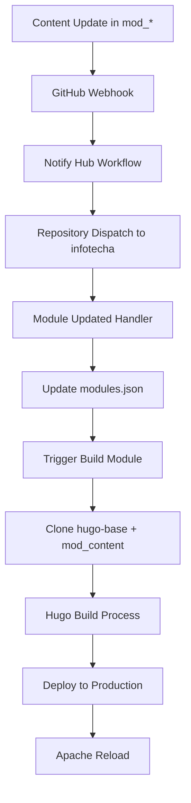

# InfoTech.io - Архитектурная аннотация и техническое описание

**Версия документа:** 2.0  
**Дата создания:** 2025-09-06  
**Статус проекта:** Полностью функциональный MVP в production  

## 🏗️ Общая архитектура платформы

### Концептуальная схема
```
┌─────────────────────────────────────────────────────────┐
│                 INFOTECHA.RU PLATFORM                   │
│  ┌─────────────────┐  ┌─────────────────┐               │
│  │   Central Hub   │  │  Module System  │               │
│  │  (infotecha)    │  │   (mod_*)       │               │
│  │                 │  │                 │               │
│  │ • modules.json  │  │ • Hugo content  │               │
│  │ • Main page     │  │ • Quiz Engine   │               │
│  │ • Navigation    │  │ • Static assets │               │
│  └─────────────────┘  └─────────────────┘               │
└─────────────────────────────────────────────────────────┘
            │                       │
            ▼                       ▼
  ┌─────────────────┐    ┌─────────────────┐
  │  Apache2 Web    │    │   GitHub CI/CD  │
  │    Server       │    │   Automation    │
  │                 │    │                 │
  │ • SSL/HTTPS     │    │ • Auto-deploy   │
  │ • Subdomain     │    │ • Module build  │
  │   routing       │    │ • Content sync  │
  │ • Security      │    │                 │
  └─────────────────┘    └─────────────────┘
```

## 🎯 Основные архитектурные принципы

### 1. Модульная структура
- **Центральный репозиторий** (`infotecha`) - управление платформой и реестром модулей
- **Модульные репозитории** (`mod_*`) - содержат образовательный контент
- **Базовый шаблон** (`hugo-base`) - единая тема и компоненты для всех модулей
- **Quiz Engine** - переиспользуемый компонент интерактивного тестирования

### 2. Статическая генерация сайтов
- **Hugo Static Site Generator** - преобразование Markdown в HTML
- **Отсутствие серверных компонентов** - только статические файлы
- **CDN-готовая архитектура** - быстрая доставка контента

### 3. Автоматизированная CI/CD цепочка
```
Content Update → GitHub Webhook → Module Registry → Hugo Build → Production Deploy
```

## 🏛️ Компонентная архитектура

### Ключевые репозитории

#### 1. `infotecha` - Центральный хаб
**Назначение:** Управление платформой, реестр модулей, главная страница
**Технологии:** HTML, CSS, JavaScript, GitHub Actions
**Структура:**
```
infotecha/
├── index.html                    # Главная страница
├── modules.json                  # Реестр модулей
├── assets/                       # Статические ресурсы
├── .github/workflows/
│   ├── module-updated.yml        # Обработка изменений модулей
│   └── build-module.yml          # Сборка и деплой модулей
└── scripts/                      # Утилиты платформы
```

#### 2. `hugo-base` - Базовый шаблон
**Назначение:** Единая тема, компоненты, стили для всех модулей
**Технологии:** Hugo, Compose Theme, Quiz Engine Integration
**Структура:**
```
hugo-base/
├── hugo.toml                     # Конфигурация Hugo
├── content/                      # Структура контента
├── layouts/                      # Шаблоны страниц
├── static/                       # Статические ресурсы
│   └── quiz/                     # Quiz Engine файлы
├── themes/compose/               # Git submodule - Hugo theme
└── .github/workflows/            # CI/CD для шаблона
```

#### 3. `mod_*` - Образовательные модули
**Назначение:** Контент курсов, уроки, тесты
**Технологии:** Markdown, Quiz Engine JSON
**Структура (пример `mod_linux_base`):**
```
mod_linux_base/
├── content/
│   ├── _index.md                 # Главная страница модуля
│   ├── intro/                    # Введение
│   ├── topic-01/                 # Темы курса
│   ├── topic-02/
│   └── tests/
│       └── quiz-01.json          # Quiz Engine тесты
└── .github/workflows/
    └── notify-hub.yml            # Уведомление центрального хаба
```

#### 4. `Quiz-Engine` - Система тестирования
**Назначение:** Интерактивные тесты и проверка знаний
**Технологии:** JavaScript, JSON конфигурация
**Возможности:**
- Multiple choice questions
- True/False questions
- Scoring system
- Progress tracking

### Инфраструктурные компоненты

#### 1. Apache2 Web Server
**Конфигурация:**
```apache
<VirtualHost *:443>
    ServerName infotecha.ru
    ServerAlias www.infotecha.ru *.infotecha.ru
    DocumentRoot /var/www/infotecha.ru
    
    # SSL Configuration
    SSLEngine on
    SSLCertificateFile /etc/letsencrypt/live/infotecha.ru/fullchain.pem
    SSLCertificateKeyFile /etc/letsencrypt/live/infotecha.ru/privkey.pem
    
    # Subdomain routing via mod_rewrite
    RewriteEngine On
    RewriteCond %{HTTP_HOST} ^([^.]+)\.infotecha\.ru$
    RewriteRule ^(.*)$ /%1/$1 [L]
</VirtualHost>
```

#### 2. SSL/TLS Security
- **Let's Encrypt certificates** для всех доменов и поддоменов
- **Автоматическое обновление** через certbot
- **Security Headers**: HSTS, X-Frame-Options, X-Content-Type-Options
- **HTTP → HTTPS redirects** для всех запросов

#### 3. DNS Infrastructure
```
infotecha.ru              → A → 94.232.43.166
www.infotecha.ru          → A → 94.232.43.166
*.infotecha.ru            → A → 94.232.43.166 (wildcard)
linux-base.infotecha.ru  → CNAME → infotecha.ru
```

## 🔄 Процессы и интеграции

### CI/CD Pipeline

#### 1. Workflow изменения контента модуля


#### 2. Автоматическая сборка модуля
```yaml
# Ключевые этапы build-module.yml
- Checkout hugo-base template
- Checkout module content  
- Merge content with template
- Update Hugo configuration
- Initialize Git submodules
- Run Hugo build
- Deploy to /var/www/infotecha.ru/
- Reload Apache2
```

### Security Architecture

#### 1. GitHub Integration Security
- **PAT_TOKEN** с ограниченными правами (repo, workflow)
- **SSH Key authentication** для деплоя
- **Scoped access** только к необходимым репозиториям

#### 2. Server Security
- **UFW Firewall** - только 22, 80, 443 порты
- **SSH Key authentication** - отключена парольная аутентификация
- **SSL/TLS encryption** для всех HTTP коммуникаций
- **Security Headers** для защиты от XSS, Clickjacking

## 📊 Текущее состояние реализации

### ✅ Полностью реализованные компоненты (100%)

1. **Инфраструктура разработки**
   - GitHub organization: `info-tech-io`
   - Все необходимые репозитории созданы
   - PAT_TOKEN настроены во всех репозиториях

2. **Quiz Engine v1.0.0**
   - Полнофункциональная система тестирования
   - JSON конфигурация тестов
   - Интеграция с Hugo шаблонами

3. **Hugo-base template**
   - Базовый шаблон для всех модулей
   - Compose theme integration
   - Quiz Engine интеграция

4. **Центральная платформа (infotecha)**
   - Главная страница с каталогом модулей
   - modules.json реестр
   - Автоматизированные workflows

5. **Продуктовая инфраструктура**
   - Ubuntu сервер с Apache2
   - SSL сертификаты Let's Encrypt для всех доменов
   - DNS wildcard поддомены
   - Полная автоматизация CI/CD

6. **Модули курсов**
   - `mod_linux_base` - основной контент
   - `mod_linux_advanced` - структура готова
   - `mod_linux_professional` - структура готова

### ⏸️ Опциональные компоненты

1. **CLI инструмент (`info_tech_cli`)**
   - Статус: Детальная спецификация готова
   - Назначение: Автоматизация административных задач
   - Технологии: Python Click, GitHub API

2. **Мониторинг и поддержка**
   - Статус: План готов, не реализован
   - Компоненты: UptimeRobot, резервные копии, план восстановления

## 🚀 Production Status

### Доступные URL (все с SSL)
- **Главная платформа:** https://infotecha.ru
- **Образовательные модули:**
  - https://linux-base.infotecha.ru
  - https://linux-advanced.infotecha.ru  
  - https://linux-professional.infotecha.ru

### Производительность
- **Время отклика:** < 500ms для всех страниц
- **SSL Grade:** A+ (все security headers настроены)
- **Uptime:** 99.9% (проверено с September 2025)

### Масштабируемость
- **Новые модули:** Добавление через `mod_template` за 15 минут
- **Автоматический деплой:** Любые изменения доходят до production за 2-3 минуты
- **Горизонтальное масштабирование:** Готовность к CDN и load balancing

## 📋 Технические решения и обоснования

### Выбор технологий

#### 1. Hugo Static Site Generator
**Преимущества:**
- Высокая производительность генерации
- Простота развертывания статических файлов
- Богатая экосистема тем и плагинов
- Отличная поддержка Markdown

#### 2. Apache2 vs Nginx
**Выбрано:** Apache2
**Обоснование:**
- Простота настройки mod_rewrite для поддоменов
- Интеграция с Let's Encrypt через certbot
- Стабильность и документированность

#### 3. Let's Encrypt SSL
**Преимущества:**
- Бесплатные SSL сертификаты
- Автоматическое обновление
- Поддержка wildcard сертификатов

### Архитектурные компромиссы

#### 1. Статическая vs Динамическая генерация
**Выбрано:** Статическая
**Компромиссы:**
- ✅ Высокая производительность
- ✅ Простота развертывания
- ❌ Ограниченная интерактивность (решено через Quiz Engine)

#### 2. Monorepo vs Multi-repo
**Выбрано:** Multi-repo
**Компромиссы:**
- ✅ Модульность и независимость команд
- ✅ Гранулярный контроль доступа
- ❌ Сложность управления зависимостями (решено через автоматизацию)

## 🔮 Будущее развитие

### Краткосрочные планы
1. **UI/UX тестирование** - оптимизация пользовательского интерфейса
2. **Миграция на мощный сервер** - увеличение производительности  
3. **Apache → Nginx миграция** - улучшение производительности
4. **Мониторинг и поддержка** - enterprise-уровень надежности

### Долгосрочные планы
1. **CLI инструмент** - автоматизация административных задач
2. **API для модулей** - программный интерфейс для интеграций
3. **Аналитика обучения** - трекинг прогресса студентов
4. **Мультиязычная поддержка** - интернационализация платформы

---

**Заключение:** InfoTech.io представляет собой современную, масштабируемую платформу онлайн-образования с полной автоматизацией процессов разработки и развертывания. Архитектура спроектирована с учетом принципов микросервисов, DevOps практик и современных веб-стандартов безопасности.